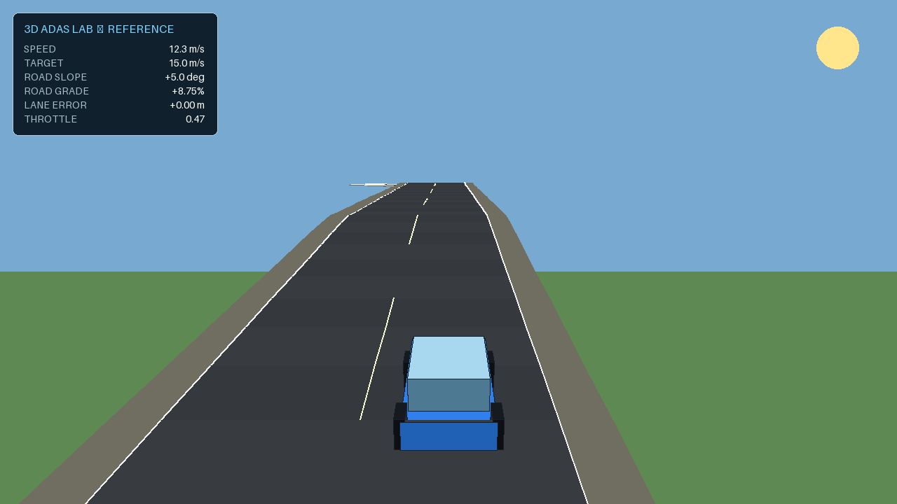

# Lightweight Python 3D ADAS simulator

This package is a small, transparent alternative to Webots for the Smart
Vehicles Control course. It contains:

- a rendered 3D passenger car;
- a closed, two-lane highway-like circuit;
- two long straight sections and two constant-radius turns;
- a flat section, a 5-degree climb, an elevated section and a 5-degree descent;
- longitudinal force-balance dynamics;
- lateral bicycle-model dynamics;
- throttle, brake and steering inputs;
- a reference PI cruise controller with anti-windup;
- a supplied Pure Pursuit lane controller;
- an editable student controller;
- live telemetry, a circuit map and a speed-history plot;
- CSV export and a non-graphical test mode.

The simulator uses only the Python standard library. The graphical interface is
drawn with `tkinter`, which is included with the normal Windows installer from
[python.org](https://www.python.org/downloads/).



## Start in Windows

1. Extract the ZIP.
2. Open the extracted `python_3d_adas` folder.
3. Double-click `run_windows.bat`.

If Windows asks which application should open the file, install Python and
enable **Add Python to PATH** during installation.

## Start from a terminal

```bash
python run_simulator.py
```

No `pip install` command is required.

## Controls

The toolbar provides:

- **Run / Pause** — stops or resumes simulation time;
- **Reset** — reloads the selected controller and returns the car to the start;
- **Controller** — selects `Reference`, `Student` or `Manual`;
- **Target speed** — changes the speed reference between 5 and 25 m/s;
- **Save CSV** — exports the current experiment.

In `Manual` mode:

- Up arrow: throttle;
- Down arrow: brake;
- Left/right arrows: steering;
- Space: pause or resume;
- R: reset.

The reference and student modes use automatic steering so Day 1 students can
concentrate on longitudinal control.

## Physical model

Longitudinal motion follows:

$$
m\dot v =
F_\mathrm{drive}
-F_\mathrm{brake}
-F_\mathrm{roll}
-c_\mathrm{drag}v^2
-mg\sin(\theta).
$$

The default values are:

| Parameter | Value |
|---|---:|
| Mass | 1200 kg |
| Maximum drive force | 4500 N |
| Maximum brake force | 8000 N |
| Rolling resistance | 180 N |
| Quadratic drag coefficient | 4 N/(m/s)^2 |
| Wheelbase | 2.8 m |
| Maximum steering angle | 28 degrees |

The 5-degree climb produces:

$$
F_\mathrm{hill}
=1200(9.81)\sin(5^\circ)
\approx1026\ \mathrm{N}.
$$

The road grade is:

$$
100\tan(5^\circ)\approx8.75\%.
$$

The lateral model is the kinematic bicycle model:

$$
\dot x=v\cos\psi,\qquad
\dot y=v\sin\psi,\qquad
\dot\psi=\frac{v}{L}\tan\delta.
$$

The source is intentionally short enough for students to inspect. It is an
educational control simulator, not a vehicle-certification or high-fidelity
multibody tool.

## Lesson 5 — guided implementation

Use `LESSON5_GUIDED.md`. Students:

1. identify all signals and units;
2. establish an open-loop baseline;
3. implement and tune P control;
4. add integral action;
5. demonstrate anti-windup;
6. compare flat-road and uphill performance.

## Lesson 6 — independent project

Use `LESSON6_PROJECT.md`. Students edit:

```text
student_controller.py
```

Pressing **Reset** reloads this file, so students can change the controller
without restarting the graphical simulator.

## Headless experiment

The same controller and physics can run without a graphical window:

```bash
python run_simulator.py \
  --headless \
  --controller reference \
  --duration 60 \
  --csv reference_run.csv
```

To test the student file:

```bash
python run_simulator.py \
  --headless \
  --controller student \
  --duration 60 \
  --csv student_run.csv
```

The terminal prints speed and lane-tracking metrics.

## Validate the package

```bash
python -m unittest discover -s tests -v
```

The tests do not open a window.

## Directory structure

```text
python_3d_adas/
├── run_simulator.py
├── run_windows.bat
├── student_controller.py
├── LESSON5_GUIDED.md
├── LESSON6_PROJECT.md
├── simulator/
│   ├── controllers.py
│   ├── gui.py
│   ├── model.py
│   ├── renderer3d.py
│   ├── simulation.py
│   └── track.py
└── tests/
    └── test_simulator.py
```
