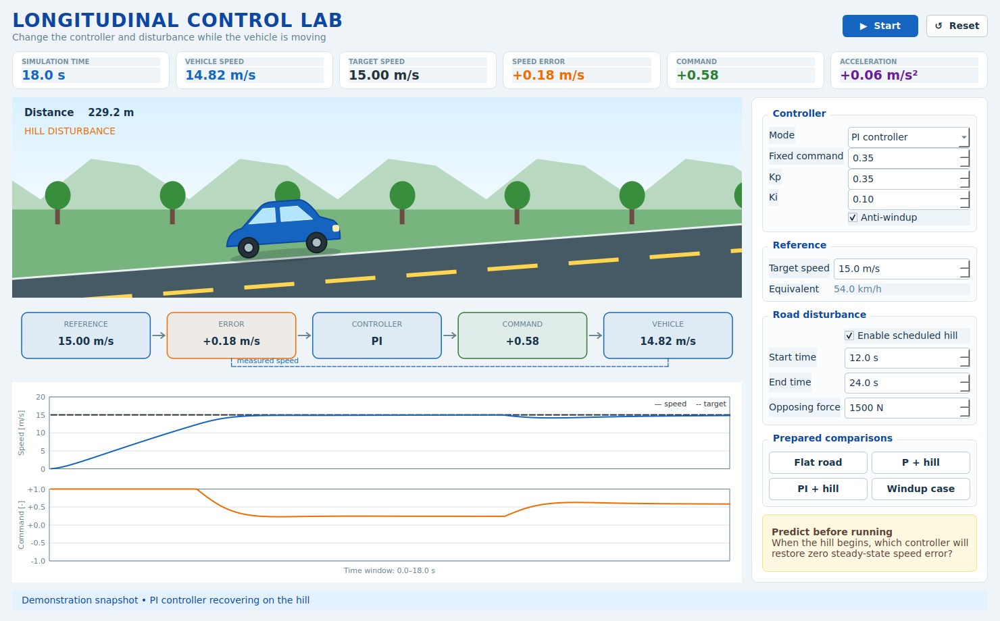

# 1. Control in autonomous vehicles

## Learning objective

Identify perception, planning and control, and recognize the elements of a closed feedback loop.

## Prepared demonstration

First open the graphical simulator:

```bash
python day_1_longitudinal/gui/day1_vehicle_simulator.py
```

Select **P + hill** or **PI + hill**, then press **Start**. The feedback strip
shows how measured speed returns from the vehicle to the error calculation.



For a static comparison plot, run:

```bash
python day_1_longitudinal/demos/lesson1_feedback_preview.py
```

Predict before running:

> Both vehicles receive an actuator command. Which one can maintain the target
> speed when the hill begins at 15 seconds?


The open-loop vehicle uses a fixed command. The PI-controlled vehicle measures
speed, calculates error and changes its command to reject the disturbance.

The teacher can safely toggle:

```python
ENABLE_HILL = True
```
