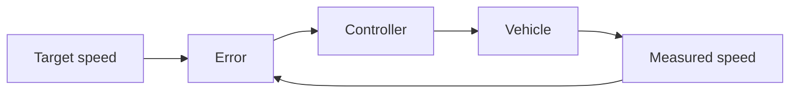

# Lesson 1 — Theory overview

**Format:** Guided theory overview with short prediction questions

**Central question:** How can a vehicle maintain $15\ \mathrm{m/s}$ when the
road load changes?

## Learning objectives

By the end of this lesson, you should be able to:

- place motion control within an autonomous-driving system;
- identify the elements and signals of a closed feedback loop;
- explain the longitudinal force-balance model;
- distinguish targets, constraints and performance metrics;
- predict the main differences between open-loop, P and PI control;
- explain why saturation and windup matter in a physical vehicle.

## Where control fits

An autonomous vehicle must answer three different questions:

| Layer | Question | Example output |
|---|---|---|
| Perception and localization | What is around the vehicle, and where am I? | Vehicle pose, lane boundary, obstacle distance |
| Planning and decision | What should the vehicle do next? | Target path and target speed |
| Motion control | What actuator command should realize that request? | Accelerator, brake and steering commands |

Planning $15\ \mathrm{m/s}$ does not make the physical vehicle travel at
$15\ \mathrm{m/s}$. The controller must translate the request into forces
while responding to measurement error, road load and actuator constraints.

### Opening prediction

> A vehicle receives a constant $40\%$ accelerator command on a flat road.
> Does it accelerate forever, settle to a constant speed, or return to rest?

Commit to one answer before reading the explanation. Increasing aerodynamic
drag eventually balances the applied force, so the simplified vehicle
approaches an equilibrium speed.

### Open-loop versus closed-loop control

An open-loop controller applies a command without using the measured outcome.
A closed-loop controller compares the target with the measured speed and acts
on their difference.

For negative feedback, define:

$$
e(t)=v_\mathrm{target}(t)-v_\mathrm{measured}(t).
$$

If the vehicle is too slow, $e>0$, so the controller should increase the drive
command. If it is too fast, $e<0$, so the controller should reduce drive or
request braking. A sign error would create positive feedback and push the
vehicle farther away from the target.

### One-minute identification task

Identify each feedback-loop element for cruise control:

| Abstract element | Cruise-control example |
|---|---|
| Reference | Requested speed |
| Measured output | Wheel-speed or fused vehicle-speed estimate |
| Error | Requested minus measured speed |
| Controller | P or PI calculation |
| Actuator | Powertrain and brakes |
| Plant | Vehicle longitudinal dynamics |
| Disturbance | Hill, wind, payload or rolling resistance |

## Requirements before tuning a controller

A controller cannot be called “good” until its requirements are stated. Separate
three kinds of statement:

- **Target:** the intended value, such as $v_\mathrm{target}=15\ \mathrm{m/s}$.
- **Constraint:** a hard or practical limit, such as $-1\le u\le1$.
- **Metric:** a measured property used for comparison.

For a step from rest to a constant target:

$$
t_r=\min\{t:v(t)\ge0.9v_\mathrm{target}\}
$$

is the 90% rise time, and

$$
M_P=
\frac{\max_t v(t)-v_\mathrm{target}}
{v_\mathrm{target}}\cdot100\%
$$

is percentage overshoot. Settling time is the time after which the response
remains inside a chosen band, here $\pm5\%$. Final error and RMSE are:

$$
e_\mathrm{final}=v_\mathrm{target}-\bar v_\mathrm{final},
\qquad
\mathrm{RMSE}=
\sqrt{\frac{1}{N}\sum_{k=1}^{N}
\left(v_{\mathrm{target},k}-v_k\right)^2}.
$$

These metrics answer different questions. A controller may have low final error
but poor transient behaviour; another may rise quickly but spend too long at
full actuator command.

### Sample acceptance criteria

Day 1 uses the following example criteria:

| Criterion | Requirement |
|---|---:|
| Flat-road rise time | $<6\ \mathrm{s}$ |
| Overshoot | $<10\%$ |
| Flat-road saturation | $<20\%$ of samples |
| Persistent-hill final error | $<0.3\ \mathrm{m/s}$ |
| Temporary-hill recovery | Return to the 5% band within $5\ \mathrm{s}$ after the hill ends |

Consider:

> If controller A has the lowest RMSE but uses full throttle for twice as long
> as controller B, is A automatically preferable?

The correct engineering response is “not without priorities and constraints.”

## Longitudinal force balance

Newton’s second law gives:

$$
m\dot v =
F_\mathrm{actuator}
-F_\mathrm{rolling}
-c_\mathrm{drag}v^2
-F_\mathrm{hill}.
$$

The signs express the chosen positive direction. Drive force is positive.
Rolling resistance, aerodynamic drag and an uphill disturbance oppose forward
motion.

### Meaning of the terms

| Term | Main dependence | Interpretation |
|---|---|---|
| $m\dot v$ | Mass and acceleration | Inertial response |
| $F_\mathrm{actuator}$ | Command and actuator dynamics | Propulsive or braking force |
| $F_\mathrm{rolling}$ | Approximately constant here | Tire and bearing losses |
| $c_\mathrm{drag}v^2$ | Square of speed | Aerodynamic resistance |
| $F_\mathrm{hill}$ | Road grade and mass | External road-load disturbance |

The model uses different maximum drive and brake forces:

$$
F_\mathrm{desired}=
\begin{cases}
uF_{\max}, & u\ge0,\\
uF_{\mathrm{brake,max}}, & u<0,
\end{cases}
\qquad -1\le u\le1.
$$

The actuator force does not change instantaneously. A first-order lag makes it
approach the desired force:

$$
\dot F_\mathrm{actuator}
=\frac{F_\mathrm{desired}-F_\mathrm{actuator}}{\tau}.
$$

### Equilibrium-speed calculation

At constant speed, $\dot v=0$. On a flat road:

$$
uF_{\max}-F_\mathrm{rolling}-c_\mathrm{drag}v_\mathrm{eq}^2=0.
$$

Therefore:

$$
v_\mathrm{eq}
=\sqrt{
\frac{uF_{\max}-F_\mathrm{rolling}}
{c_\mathrm{drag}}
}.
$$

This result resolves the opening prediction. It also shows that open-loop speed
depends on the vehicle model: the same command gives a different equilibrium
when drag, rolling resistance or road grade changes.

!!! question "Prediction prompts"
    1. Does mass change the theoretical equilibrium speed in this model?
    2. Does mass change how quickly the vehicle approaches equilibrium?
    3. What happens to equilibrium speed if drag doubles?

??? success "Answers"
    1. No. Mass disappears when acceleration is zero.
    2. Yes. Greater mass gives lower acceleration for the same net force.
    3. The equilibrium speed is divided by $\sqrt{2}$, not by two.

## P and PI control

A proportional controller uses the current error:

$$
u_\mathrm{raw}=K_Pe,
\qquad
u=\operatorname{clip}(u_\mathrm{raw},-1,1).
$$

Increasing $K_P$ generally gives a stronger correction, but the physical
command cannot exceed its limits. Once $u_\mathrm{raw}>1$, a larger gain does
not produce more force at that instant.

### Why P control retains error on a hill

Suppose a constant positive command $u_\mathrm{hold}$ is required to balance
drag, rolling resistance and a hill. For P control:

$$
u_\mathrm{hold}=K_Pe_\mathrm{ss}.
$$

Therefore:

$$
e_\mathrm{ss}=\frac{u_\mathrm{hold}}{K_P}.
$$

A non-zero command requires a non-zero steady-state error. Raising $K_P$
reduces this offset but may increase saturation and sensitivity to effects not
represented in the simple simulation.

A PI controller adds the accumulated error:

$$
I_k=I_{k-1}+e_k\Delta t,
\qquad
u_{\mathrm{raw},k}=K_Pe_k+K_II_k.
$$

The integral term can supply the holding command even when the current error
approaches zero. This is why PI control can reject a constant hill disturbance.

### Worked one-step example

Given $v_\mathrm{target}=15\ \mathrm{m/s}$,
$v=12\ \mathrm{m/s}$ and $K_P=0.35$:

$$
e=15-12=3\ \mathrm{m/s},
$$

$$
u_\mathrm{raw}=0.35(3)=1.05,
$$

$$
u=\operatorname{clip}(1.05,-1,1)=1.
$$

The controller asks for more than the actuator can provide. Increasing $K_P$
at this instant changes the raw command but not the applied command.

## Saturation, windup and review

During a steep hill, the target may be temporarily unreachable even at
$u=1$. Without anti-windup, a PI controller continues accumulating positive
error. When the hill ends, the stored integral can keep the command positive
even after the vehicle is too fast.

Day 1 uses **conditional integration**: the integrator pauses when the command
is saturated and the current error would drive it farther into saturation.

### Individual exit check

Write one sentence for each answer:

1. Why does a constant accelerator command not guarantee constant speed?
2. What is the difference between a target, a constraint and a metric?
3. Why does a P controller retain error under a constant hill load?
4. Why can a larger $K_P$ have no physical effect during saturation?
5. What behaviour does anti-windup try to prevent?

??? success "Suggested answers"
    1. The resulting speed depends on the balance between actuator force and
       speed-dependent resistance and disturbances.
    2. A target states the desired value, a constraint limits allowable
       behaviour, and a metric measures performance.
    3. P control needs a non-zero error to create the non-zero holding command.
    4. The applied command is already clipped at the actuator limit.
    5. It prevents excessive stored integral action and the resulting delayed
       recovery or overshoot after saturation.

## Reserve activity

Derive the open-loop command required to hold an arbitrary speed on a hill:

$$
u_\mathrm{eq}
=\frac{
F_\mathrm{rolling}
+c_\mathrm{drag}v^2
+F_\mathrm{hill}
}{F_{\max}}.
$$

Then evaluate whether $15\ \mathrm{m/s}$ is physically reachable for
$F_\mathrm{hill}=4000\ \mathrm{N}$ with the default vehicle. If
$u_\mathrm{eq}>1$, no controller tuning can make the target feasible.

This is the key distinction between a control-design problem and an actuator-
authority problem.
