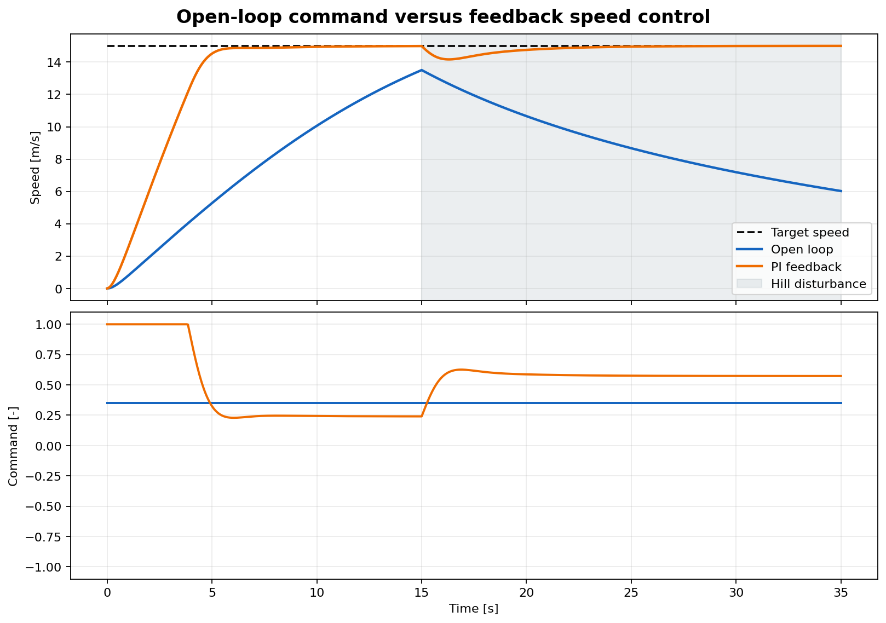
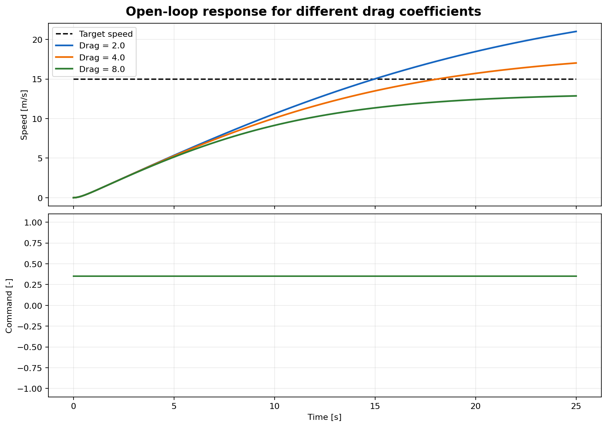
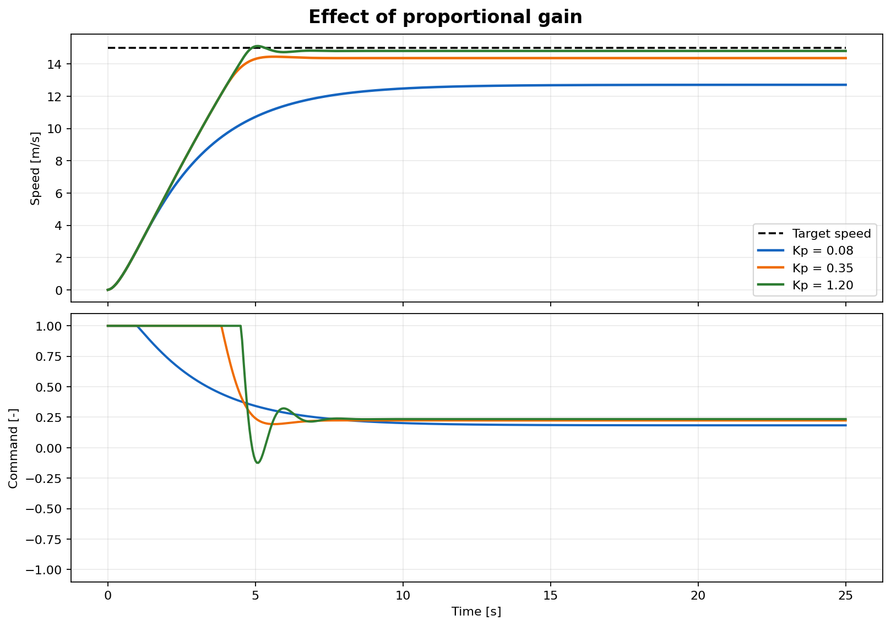
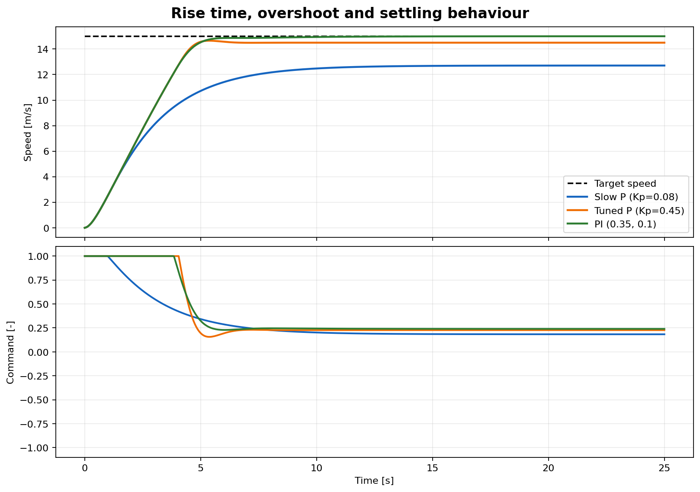
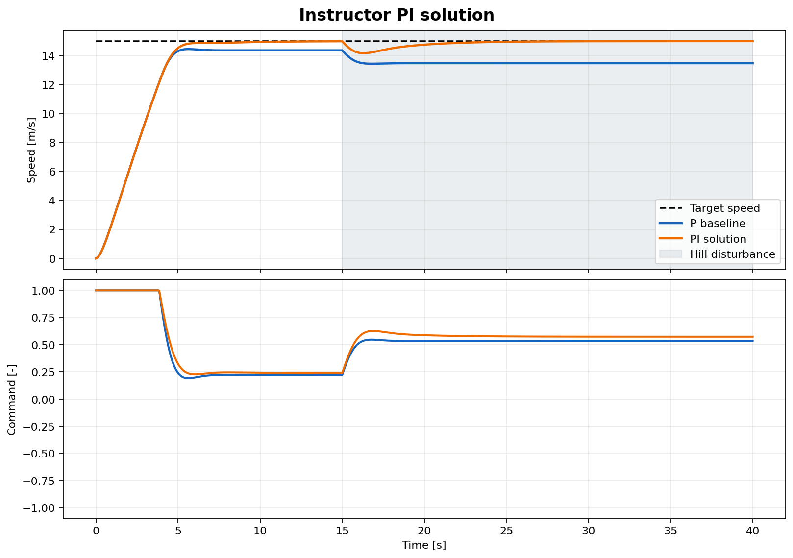
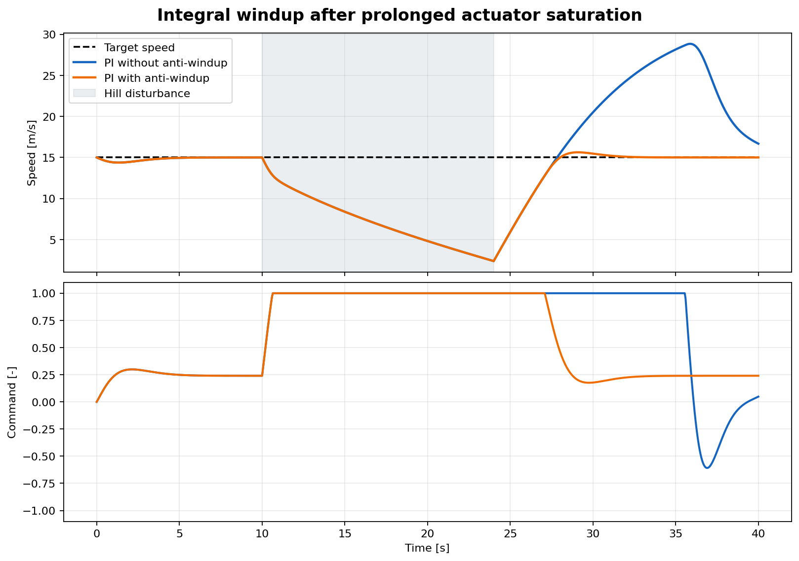

# Lesson 2 — Four practical Python demonstrations


**Format:** Four guided prediction–simulation–interpretation cycles

## Learning objectives

By the end of this lesson, you should be able to:

- use simulation as a controlled experiment;
- distinguish observation from explanation;
- connect force balance to open-loop speed;
- connect proportional gain to error and saturation;
- recognize persistent error, integral correction and windup;
- compare controllers using metrics rather than plot appearance alone.

## Before the lesson

Keep the following five files open in an editor:

```text
courses\day_1\demos\lesson1_feedback_preview.py
courses\day_1\demos\lesson2_response_metrics.py
courses\day_1\demos\lesson3_open_loop.py
courses\day_1\demos\lesson4_p_control.py
courses\day_1\demos\lesson6_windup.py
```

Only edit values in the marked `SAFE LIVE MODIFICATIONS` blocks. The prepared
figures on this page provide a fallback if a projector or plotting window fails.

## Demonstration 1 — Open loop versus feedback

### Prediction

> Both vehicles receive an actuator command. When a $1500\ \mathrm{N}$ hill
> begins at $t=15\ \mathrm{s}$, which vehicle returns closest to
> $15\ \mathrm{m/s}$?

Write two parts: the predicted vehicle and the causal mechanism.

### Run

```bash
python courses\day_1\demos\lesson1_feedback_preview.py
```



The open-loop controller applies:

```python
OPEN_LOOP_COMMAND = 0.35
```

The feedback case uses a PI controller. After the first run, change only:

```python
ENABLE_HILL = False
```

Run again, then restore `ENABLE_HILL = True`.

### Read the evidence

Identify:

- the instant the disturbance begins;
- the speed loss in each case;
- whether the command changes after the disturbance;
- whether the final error approaches zero;
- why the target line has no causal effect on the open-loop case.

### Engineering conclusion

Open-loop control can work under the conditions for which its command was
chosen, but it cannot observe and correct an unexpected change. Feedback creates
a correction from the measured outcome.

### Additional prompt if time remains

> If the speed sensor reports $1\ \mathrm{m/s}$ too little, does feedback
> still guarantee the true speed is correct?

No. Feedback regulates the measured variable. Sensor bias can create true-state
error even when the measured error is small.

## Demonstration 2 — Force balance and aerodynamic drag

### Prediction

The command is fixed at $u=0.35$. Rank the final speeds for:

$$
c_\mathrm{drag}\in\{2,4,8\}\ \mathrm{N/(m/s)^2}.
$$

Also predict whether the three vehicles have the same initial acceleration.

### Run

```bash
python courses\day_1\demos\lesson3_open_loop.py
```



The safe parameters are:

```python
OPEN_LOOP_COMMAND = 0.35
DRAG_VALUES = (2.0, 4.0, 8.0)
```

For a second run, use:

```python
OPEN_LOOP_COMMAND = 0.20
```

Restore `0.35` afterward.

### Read the evidence

At equilibrium on a flat road:

$$
v_\mathrm{eq}
=\sqrt{
\frac{uF_{\max}-F_\mathrm{rolling}}
{c_\mathrm{drag}}
}.
$$

Check whether the evidence supports the following statements:

- greater drag lowers the equilibrium speed;
- the difference grows as speed increases because the drag force is quadratic;
- a constant command does not create constant acceleration;
- early acceleration is similar because aerodynamic drag is initially small;
- reducing the command lowers both net force and equilibrium speed.

### Engineering conclusion

An open-loop command is model-dependent. A command calibrated for one vehicle,
payload or aerodynamic configuration cannot be assumed to produce the same
speed in another.

### Additional quantitative prompt

Using $F_{\max}=4500\ \mathrm{N}$ and
$F_\mathrm{rolling}=180\ \mathrm{N}$, estimate the equilibrium speed for
$u=0.35$ and $c_\mathrm{drag}=4$:

$$
v_\mathrm{eq}
=\sqrt{\frac{0.35(4500)-180}{4}}
\approx18.67\ \mathrm{m/s}.
$$

The finite-duration plot may not reach the exact theoretical value because the
vehicle still has transient dynamics and actuator lag.

## Demonstration 3 — Proportional gain and measurable performance

### Prediction

For $K_P=0.08,\ 0.35,\ 1.20$, predict:

1. which response reaches 90% of the target first;
2. which has the smallest final error;
3. which spends the largest fraction of time saturated;
4. whether tripling an already high gain must triple acceleration.

### Run the gain comparison

```bash
python courses\day_1\demos\lesson4_p_control.py
```



The safe edit is:

```python
KP_VALUES = (0.08, 0.35, 1.20)
```

If you expect an unlimited benefit from gain, try:

```python
KP_VALUES = (0.35, 1.20, 2.00)
```

### Run the prepared metrics comparison

```bash
python courses\day_1\demos\lesson2_response_metrics.py
```



The second script compares a slow P controller, a tuned P controller and a PI
controller. Identify rise time, overshoot, settling time, final error, RMSE and
saturation in the printed table.

### Read the evidence

A higher proportional gain:

- produces a larger raw command for the same error;
- often reduces rise time and steady-state offset;
- reaches actuator saturation earlier;
- gives diminishing physical benefit while saturated;
- would normally increase sensitivity to delay, noise and unmodelled dynamics.

The simple Day 1 plant may not oscillate dramatically at high gain. This is a
property of the current model, not proof that arbitrary gain is safe in a real
vehicle.

### Engineering conclusion

Gain selection is a constrained design decision. The “best” gain depends on the
accepted balance among speed, accuracy, command effort, comfort and robustness.

## Demonstration 4 — PI disturbance rejection and windup

### Part A: persistent hill

Run the PI starter once with `KI = 0.00`:

```bash
python courses\day_1\demos\challenge_pi_control.py
```

Then edit:

```python
KI = 0.10
```

and run again.



Answer:

> If the current speed error approaches zero, how can the PI controller still
> produce the command required to balance the hill?

The accumulated integral state supplies the holding command.

### Part B: temporarily unreachable target

Predict what happens after a very steep hill ends:

```bash
python courses\day_1\demos\lesson6_windup.py
```



During the hill, the target is physically unreachable. The command saturates at
full drive. Without anti-windup, the integral state keeps increasing. After the
hill ends, the stored positive integral continues requesting drive even when the
vehicle is already too fast.

### Read the evidence

Compare:

- command saturation during the hill;
- accumulated integral error;
- speed immediately after the hill ends;
- peak post-hill speed;
- time required to return to the 5% band.

### Engineering conclusion

Integral action solves persistent offset but creates an internal state that must
be managed under actuator constraints. Anti-windup is part of the controller,
not an optional plotting improvement.

## Evidence table

Complete this table before discussion:

| Demonstration | Prediction | Key numerical or visual evidence | Physical/control explanation | Limitation of the conclusion |
|---|---|---|---|---|
| Open loop vs feedback | | | | |
| Same command, different drag | | | | |
| Low vs high $K_P$ | | | | |
| PI and anti-windup | | | | |

Use this form for a 30-second conclusion:

> We changed **[factor]** while keeping **[conditions]** constant. We observed
> **[metric or plot feature]**. This occurred because **[equation or control
> mechanism]**. The result may not generalize when **[limitation]**.

## Reserve activities

Choose one if the demonstrations finish early.

### Reserve A — Feasibility threshold

Calculate the largest hill force that can be balanced at
$15\ \mathrm{m/s}$ with full drive:

$$
F_{\mathrm{hill,max}}
=F_{\max}-F_\mathrm{rolling}-c_\mathrm{drag}(15)^2.
$$

With the default model:

$$
F_{\mathrm{hill,max}}=4500-180-4(225)=3420\ \mathrm{N}.
$$

Any larger constant hill makes the target infeasible regardless of controller
gain.

### Reserve B — Design a falsification test

Choose one claim and propose a simulation that could disprove it:

- “Feedback always gives the correct true speed.”
- “Higher $K_P$ is always better.”
- “PI control always outperforms P control.”
- “A constant command produces a constant speed.”

The proposed test must state the changed factor, controlled factors, measured
metric and result that would falsify the claim.
