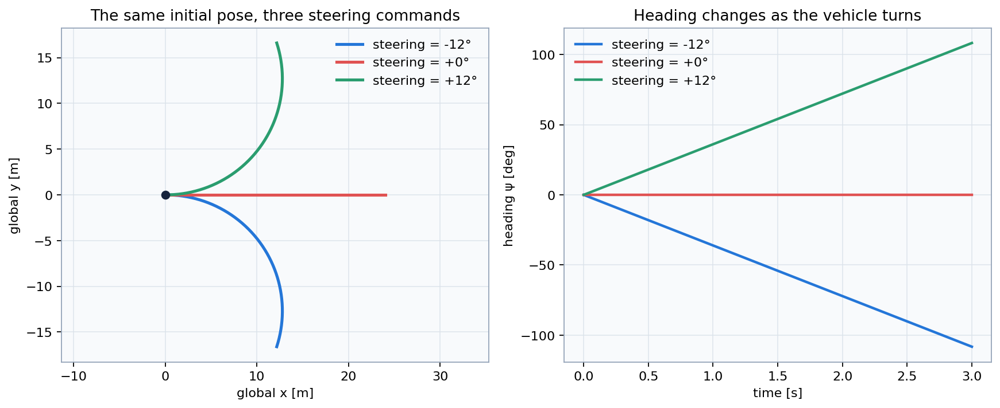
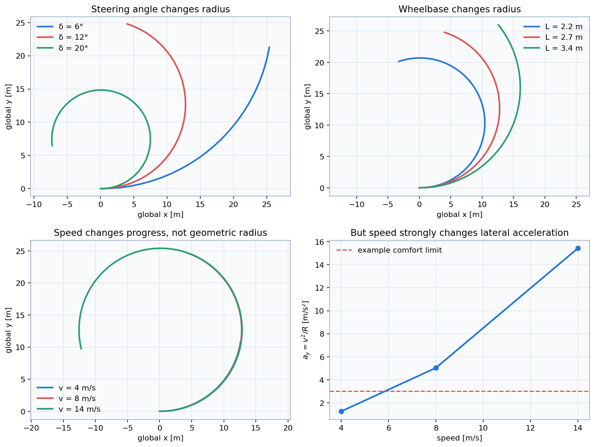
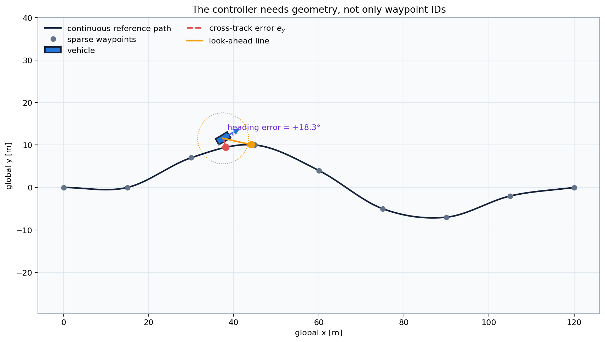

# Lesson 2 — Hands-on Python demonstrations

- **Format:** Four guided demonstrations
- **Main outcome:** Connect the Day 2 equations to visible and measurable
  vehicle behaviour

Work in pairs. One person runs the scripts while the other records predictions
and observations. Exchange roles after Demonstration 2.

## Before starting

Open Command Prompt in the package root:

```bat
python setup_check.py
```

For every demonstration:

1. write a prediction before running;
2. run the unchanged script;
3. identify the controlled comparison;
4. record at least one numerical or geometric observation;
5. explain the result with an equation.

## Demonstration 1: bicycle-model motion

Run:

```bat
python courses\day_2\demos\lesson1_bicycle_motion.py
```

Three vehicles receive constant steering commands.

Before running, predict the path for:

- negative steering;
- zero steering;
- positive steering.

Observe:

- the initial heading;
- the sign of heading change;
- the circular shape for non-zero steering;
- the difference between commanded and applied steering if the steering-rate
  limit is enabled.



Record:

| Steering command | Direction | Approximate path shape | Heading changes? |
|---:|---|---|---|
| Negative | | | |
| Zero | | | |
| Positive | | | |

Connect the result to:

$$
\dot{\psi}=\frac{v}{L}\tan\delta.
$$

## Demonstration 2: steering, wheelbase and speed

Run:

```bat
python courses\day_2\demos\lesson2_steering_exploration.py
```

The script changes one variable at a time.

Predict:

1. Which vehicle has the smaller radius: $\delta=6^\circ$ or
   $\delta=12^\circ$?
2. At the same steering, which vehicle turns more tightly: $L=2.4$ m or
   $L=3.2$ m?
3. Does doubling speed change the geometric radius?
4. What happens to lateral acceleration?



Record:

| Changed factor | Effect on radius | Effect on yaw rate | Effect on $a_y$ |
|---|---|---|---|
| Larger $|\delta|$ | | | |
| Larger $L$ | | | |
| Larger $v$ | | | |

Use:

$$
R=\frac{L}{\tan\delta},
\qquad
a_y=\frac{v^2}{R}.
$$

!!! warning
    A trajectory can be geometrically valid while its lateral acceleration is
    too large for comfort or tire friction.

## Demonstration 3: path and error geometry

Run:

```bat
python courses\day_2\demos\lesson3_path_errors.py
```

Identify:

- sparse waypoints;
- the smooth reference path;
- vehicle position and heading;
- nearest point;
- left normal;
- signed cross-track error;
- heading error;
- preview target.



Answer:

1. Is the shown cross-track error positive or negative?
2. Would the sign change if the car crossed to the other side?
3. Could the nearest point and preview point be identical?
4. Why does the controller target a point ahead rather than the nearest point?

Record:

```text
Cross-track-error sign:
Heading-error sign:
Nearest point means:
Preview point means:
```

??? success "Check"
    The sign depends on which side of the oriented path the car occupies. The
    preview target is deliberately ahead: targeting only the nearest point can
    create reactive, oscillatory steering and does not encode where the road is
    going.

## Demonstration 4: Pure Pursuit look-ahead

Run:

```bat
python courses\day_2\demos\lesson4_pure_pursuit.py
```

The script compares short, balanced and long fixed look-ahead distances on the
same path, from the same initial condition and at the same speed.


Complete:

| Look-ahead | Mean $|e_y|$ | Maximum $|e_y|$ | Steering-rate RMS | Road departure | Interpretation |
|---:|---:|---:|---:|---:|---|
| Short | | | | | |
| Balanced | | | | | |
| Long | | | | | |

Do not select a controller using only mean error. A short look-ahead may achieve
small ordinary error while demanding rapid steering changes or briefly leaving
the road.

## Evidence summary

Complete one sentence for each observation:

1. Increasing steering angle changed the radius because ...
2. Increasing speed changed lateral acceleration because ...
3. Cross-track and heading error are both needed because ...
4. Shortening look-ahead improved ... but worsened ...

### Optional headless mode

If a graph window cannot open, run:

```bat
python courses\day_2\demos\run_all_demos.py
```

The numerical calculations remain available, and prepared figures are included
under `docs/images/`.

## Required output

Keep:

- the three small evidence tables;
- your four summary sentences;
- one question that the demonstrations did not answer.

You will use these observations to solve the numerical exercises in Lesson 3.
