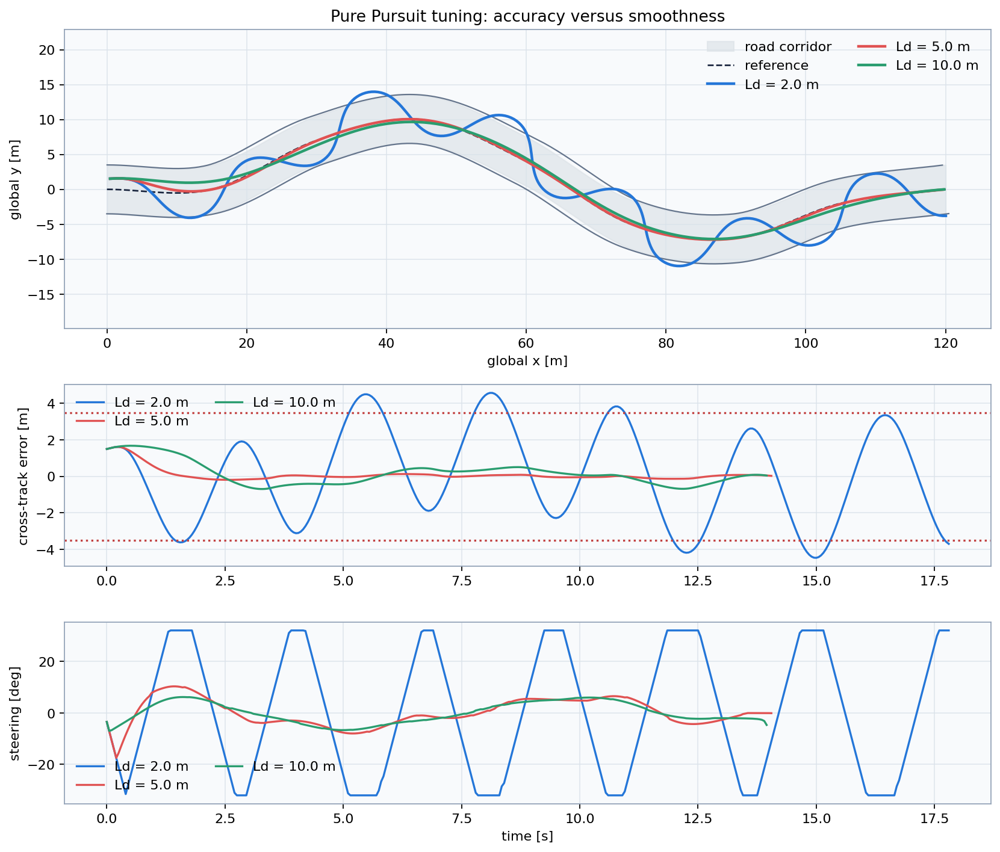

# Lesson 4 — Pure Pursuit

## Learning objective

Explain how a look-ahead target produces a steering command and predict the
effect of look-ahead distance.

## Controller geometry

The target bearing relative to the vehicle is:

\[
\alpha=
\operatorname{wrap}\left[
\operatorname{atan2}(y_t-y,x_t-x)-\psi
\right]
\]

Pure Pursuit asks for the circular arc that reaches the look-ahead target. Its
steering command is:

\[
\delta=
\tan^{-1}\left(
\frac{2L\sin\alpha}{L_d}
\right)
\]

where \(L_d\) is the look-ahead distance.

## Main tuning tradeoff

| Look-ahead | Typical benefit | Typical risk |
|---|---|---|
| Too short | Fast correction and close tracking | Oscillation, saturation, noise sensitivity |
| Balanced | Useful accuracy/smoothness compromise | Depends on speed and path |
| Too long | Smooth steering | Curve cutting and slow recovery |

## Prepared comparison

```bat
python day_2\demos\lesson4_pure_pursuit.py
```



The short-look-ahead case is deliberately aggressive. It may reach the
steering limit and leave the road. The long case remains smooth but follows the
reference less closely.

## Read the metrics

- mean \(|e_y|\): ordinary tracking accuracy;
- max \(|e_y|\): worst deviation;
- outside-road percentage: hard safety indicator;
- steering-rate RMS: steering activity and smoothness;
- completion: whether the vehicle actually finished.

## Check your understanding

1. Why can the configuration with the smallest mean error still be unsuitable?
2. Which metric exposes a brief large deviation?
3. Why is there no universal best \(L_d\)?
