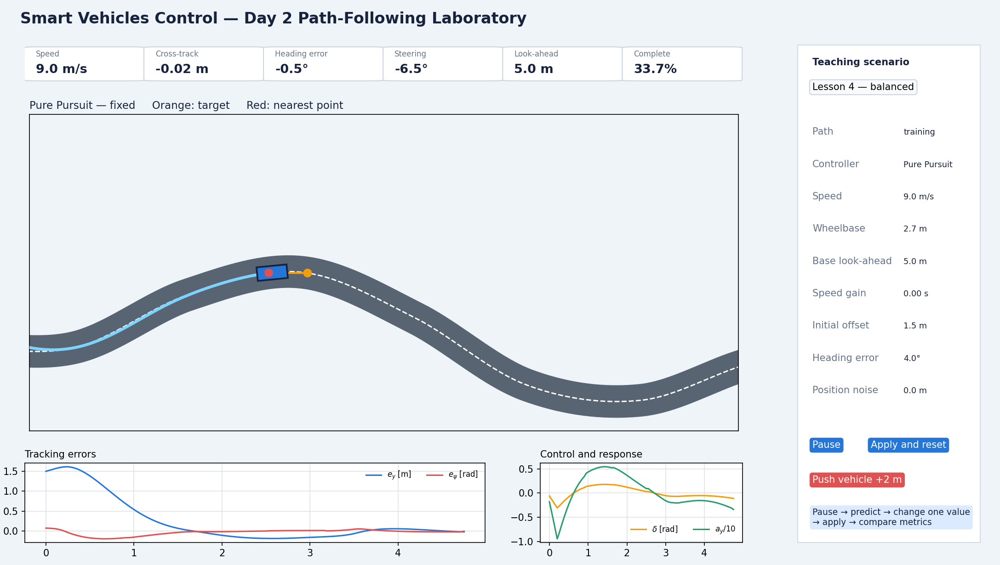

# Lesson 4 — Guided exercises with the PyQt simulator

- **Format:** Guided laboratory in pairs
- **Main outcome:** Select a defensible look-ahead configuration using
  quantitative evidence

This lesson uses a two-dimensional simulator so you can see the complete road,
reference path, preview geometry, trajectory and metrics at the same time.

## Start the laboratory

From the package root:

```bat
python courses\day_2\gui\day2_vehicle_simulator.py
```



The main controls are:

| Control | Meaning |
|---|---|
| Path | gentle, training or tight reference |
| Controller | constant steering, nearest-point P or Pure Pursuit |
| Speed | prescribed speed used to isolate lateral behaviour |
| Base look-ahead | fixed preview distance $L_{d,0}$ |
| Speed gain | $K_v$ in $L_d=L_{d,0}+K_vv$ |
| Initial offset | starting cross-track error |
| Initial heading | starting orientation error |
| Push vehicle +2 m | repeatable lateral disturbance |

After changing parameters, press **Apply and reset**. Change only the variables
listed for each exercise.

## Exercise 1: verify steering geometry

Configure:

| Setting | Value |
|---|---:|
| Path | gentle |
| Controller | Constant steering |
| Speed | 8 m/s |
| Wheelbase | 2.7 m |
| Constant steering | $12^\circ$ |
| Initial offset | 0 m |
| Initial heading | $0^\circ$ |

Before running, calculate:

$$
R=\frac{2.7}{\tan12^\circ}.
$$

Then:

1. run for 5–8 s;
2. observe whether the path is approximately circular;
3. repeat with $6^\circ$ steering;
4. repeat with wheelbase 3.2 m;
5. repeat at 12 m/s without changing steering.

Record:

| Case | Predicted radius | Observed change | $a_y$ interpretation |
|---|---:|---|---|
| $12^\circ$, $L=2.7$ m, 8 m/s | | | |
| $6^\circ$, $L=2.7$ m, 8 m/s | | | |
| $12^\circ$, $L=3.2$ m, 8 m/s | | | |
| $12^\circ$, $L=2.7$ m, 12 m/s | | | |

??? success "Reference calculation"
    $$
    R=\frac{2.7}{\tan12^\circ}=12.70\ \mathrm m.
    $$

    Changing speed does not change this ideal radius. It does change yaw rate
    and lateral acceleration:

    $$
    a_y=\frac{v^2}{R}.
    $$

## Exercise 2: separate the two errors

Configure:

| Setting | Value |
|---|---:|
| Path | training |
| Controller | Pure Pursuit — fixed |
| Speed | 8 m/s |
| Base look-ahead | 6 m |
| Initial offset | 2.2 m |
| Initial heading | $18^\circ$ |

Pause immediately and enable the geometry overlay.

Identify:

- the nearest reference point;
- the preview point;
- cross-track error;
- heading error;
- the steering direction.

Now run three controlled cases:

| Initial offset | Initial heading | Which error is non-zero? | Initial steering direction |
|---:|---:|---|---|
| 2.0 m | $0^\circ$ | | |
| 0.0 m | $15^\circ$ | | |
| 2.0 m | $15^\circ$ | | |

Explain why the third trajectory is not the sum of two independent straight
corrections. The vehicle state and preview target change continuously.

## Exercise 3: tune fixed look-ahead

Use the same initial condition for every test:

| Setting | Value |
|---|---:|
| Path | training |
| Controller | Pure Pursuit — fixed |
| Speed | 9 m/s |
| Initial offset | 1.5 m |
| Initial heading | $4^\circ$ |

Test $L_d=2$, 5 and 10 m.

Before running, rank them from:

- fastest correction to slowest;
- highest steering activity to lowest;
- most likely curve cutting to least.

Run each case to completion and record:

| $L_d$ | Mean $|e_y|$ | Max $|e_y|$ | Outside road | Steering-rate RMS | Completion | Decision |
|---:|---:|---:|---:|---:|---:|---|
| 2 m | | | | | | |
| 5 m | | | | | | |
| 10 m | | | | | | |

Reject any configuration that leaves the road, even if its mean error is small.

??? success "Expected pattern"
    The 2 m case is deliberately aggressive and may oscillate, saturate or
    leave the road. Around 5 m normally gives a useful compromise on the
    training course. The 10 m case is smoother but tends to cut curves and
    recover more slowly. Use your measured values rather than copying this
    qualitative description.

## Exercise 4: speed-dependent look-ahead

First create a high-speed fixed-look-ahead baseline:

| Setting | Value |
|---|---:|
| Path | training |
| Controller | Pure Pursuit — fixed |
| Speed | 14 m/s |
| Base look-ahead | 4 m |
| Initial offset | 0.5 m |
| Initial heading | $0^\circ$ |

Run 5 s, then press **Push vehicle +2 m**. Record recovery and steering
activity.

Next select **Pure Pursuit — adaptive**:

| Parameter | Value |
|---|---:|
| Base look-ahead $L_{d,0}$ | 2.2 m |
| Speed gain $K_v$ | 0.32 s |

At 14 m/s:

$$
L_d=2.2+0.32(14)=6.68\ \mathrm m.
$$

Apply the same disturbance at the same time.

| Case | Actual $L_d$ | Max $|e_y|$ | Recovery time | Steering-rate RMS | Outside road |
|---|---:|---:|---:|---:|---:|
| Fixed | | | | | |
| Adaptive | | | | | |

The adaptive controller does not have to minimize every metric. Decide whether
its improvement in smoothness and high-speed behaviour is worth any increase
in ordinary tracking error.

## Engineering conclusion

Complete:

```text
Selected fixed look-ahead:
Selected adaptive base:
Selected speed gain:
Best accuracy metric:
Best smoothness metric:
Any road departure:
One observed trade-off:
One limitation of the experiment:
```

Each pair reports one result supported by two different metrics.

## Troubleshooting

### PyQt6 is missing

From the package root:

```bat
py -3.12 -m pip install -r requirements.txt
```

### The settings appear unchanged

Press **Apply and reset** after editing a value.

### A run starts from a different state

Check initial offset and heading, then reset. Comparisons are meaningful only
when the initial condition is identical.

### The short-look-ahead controller fails

That may be a valid result. Record the road-departure and steering metrics; do
not silently discard an unsafe configuration.

## Fast-finisher extension

Use the tight path and find the largest speed at which your selected controller
finishes without road departure. State whether the limiting factor appears to
be tracking error, steering angle, steering rate or lateral acceleration.
