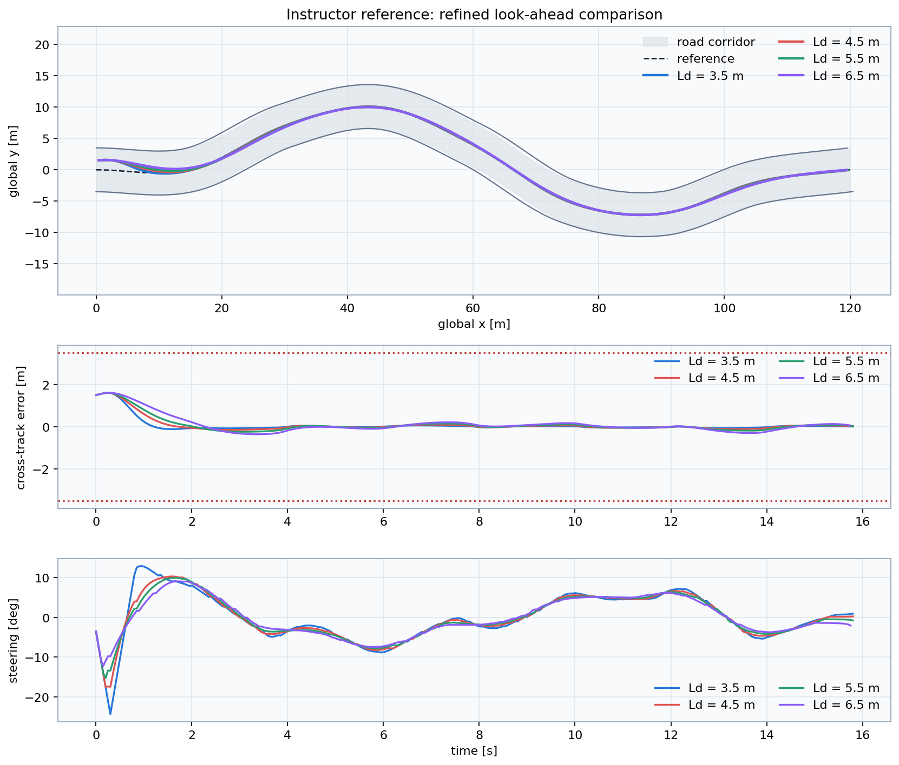

# Lesson 5 — Workshop: make the vehicle follow the road

## Learning objective

Tune Pure Pursuit systematically, reject unsafe candidates and justify the
selected look-ahead with objective evidence.

## Requirements

- path completion above 95%;
- no samples outside the \(\pm3.5\) m road corridor;
- mean absolute cross-track error below 0.70 m;
- compare smoothness, not accuracy alone;
- retest the selected value at a higher speed.

## Run the baseline

```bat
python day_2\student\workshop_lookahead_tuning.py
```

Edit only:

```python
LOOKAHEAD_CANDIDATES_M = (2.0, 5.0, 10.0)
VEHICLE_SPEED_MPS = 8.0
```

## Required workflow

1. Predict the three outcomes.
2. Run the unchanged baseline.
3. Record all metrics.
4. Eliminate candidates that leave the road.
5. Replace one candidate to narrow the useful range.
6. Run again at 13 m/s.
7. Select one value and write a two-sentence conclusion.

## Results table

| \(L_d\) [m] | Mean \(|e_y|\) [m] | Max \(|e_y|\) [m] | Outside road [%] | Steering-rate RMS [deg/s] | Decision |
|---:|---:|---:|---:|---:|---|
| | | | | | |
| | | | | | |
| | | | | | |

## Advanced task

```bat
python day_2\student\advanced_lookahead_sweep.py
```

This script evaluates a dense range and combines accuracy with steering
activity:

\[
J=\operatorname{mean}|e_y|+
w_s\,\operatorname{RMS}(\dot{\delta})
\]

Change \(w_s\). The selected optimum changes because the score represents a
design preference, not a law of nature.

## Expected workshop pattern



Do not copy one numeric answer without testing it. The useful range changes
with path, speed, wheelbase, limits and measurement quality.
