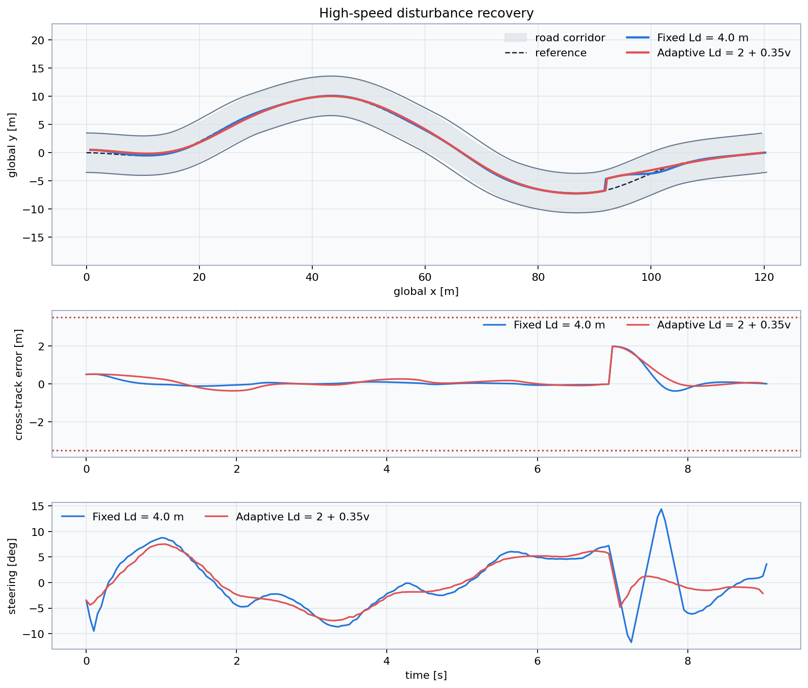

# Lesson 6 — Speed-dependent tracking and comparison

## Learning objective

Tune a simple speed-dependent look-ahead rule and evaluate recovery from a
lateral disturbance.

## Why adapt look-ahead?

At high speed the vehicle covers more distance during each control interval.
A short fixed look-ahead can demand rapid steering reversals, while a value
chosen only for high speed may be too unresponsive at low speed.

A common teaching rule is:

\[
L_d=L_{d,0}+K_vv
\]

- \(L_{d,0}\): minimum low-speed look-ahead;
- \(K_v\): speed gain in seconds;
- \(v\): current vehicle speed.

## Prepared comparison

```bat
python day_2\demos\lesson6_adaptive_preview.py
```



The adaptive result may have slightly larger ordinary tracking error but lower
steering activity. Controller design is a multi-objective tradeoff.

## Student challenge

```bat
python day_2\student\challenge_adaptive_lookahead.py
```

Tune only:

```python
BASE_LOOKAHEAD_M = 3.0
SPEED_GAIN_S = 0.0
```

The same rule is evaluated at 6 and 14 m/s. A 1.8 m lateral displacement is
injected during each run.

## Recovery metric

Recovery time begins at the disturbance and ends when:

\[
|e_y| \le 0.5\ {\rm m}
\]

for at least 0.75 s continuously. Requiring sustained recovery prevents a
brief crossing of the tolerance band from being counted as success.

## Final discussion

The Day 2 model omits:

- lateral tire forces and slip;
- friction limits;
- roll and load transfer;
- steering-system dynamics beyond a rate limit;
- coupled braking and cornering;
- sensor delay and localization loss.

These limitations do not make the model useless. They define what conclusions
the simulation can and cannot support. Day 3 combines the lateral controller
with speed control and traffic behaviour.
