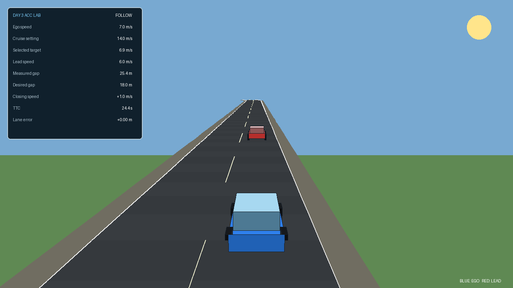

# Day 3 — Adaptive Cruise Control and traffic-aware driving

**Central engineering question:** How can the ego vehicle maintain a useful
speed while preserving a safe, speed-dependent distance from a slower or
braking lead vehicle?

On Day 1, you developed longitudinal speed control. On Day 2, you added lateral
path following. Day 3 keeps both completed controllers and introduces a third
layer: traffic-aware target-speed selection.

The same blue ego car will now encounter a red lead vehicle. A simulated
forward-ranging sensor reports:

- whether a lead vehicle is detected;
- bumper-to-bumper distance;
- lead-vehicle speed;
- closing speed;
- time to collision when the gap is decreasing.

You will use these signals to implement Adaptive Cruise Control (ACC), test it
in stop-and-go traffic and explain the safety–efficiency trade-off of its
parameters.



## Day plan

| Lesson | Format | Main activity | Required output |
|---:|---|---|---|
| 1 | Theory | Sensing, desired gap, TTC, ACC target and safety logic | Concept check |
| 2 | Guided Python demonstrations | Observe headway and state-transition effects | Evidence table |
| 3 | Numerical exercises | Calculate gaps, TTC, targets and actuator commands | Calculation sheet |
| 4 | Guided PyQt laboratory | Compare headways and safety thresholds | Results table and conclusion |
| 5 | Guided 3D-like simulation | Implement ACC while retaining Days 1–2 control | Working traffic-aware controller |
| 6 | Individual simulator project | Tune and validate a stop-and-go traffic run | Controller, CSV evidence and scorecard |

Detailed instructions:

1. [Theory: Adaptive Cruise Control](lesson1.md)
2. [Hands-on Python demonstrations](lesson2.md)
3. [Numerical engineering exercises](lesson3.md)
4. [Guided PyQt simulator exercises](lesson4.md)
5. [Guided ACC implementation](lesson5.md)
6. [Individual stop-and-go traffic project](lesson6.md)

## What you should be able to do by the end

You should be able to:

- distinguish cruise control from Adaptive Cruise Control;
- define gap, closing speed, time headway and time to collision;
- calculate a constant-time-headway desired distance;
- explain why gap alone is not enough for safe target selection;
- calculate a simplified ACC speed target;
- select the lower of driver, road and traffic speed constraints;
- trace Cruise, Follow, Brake and Emergency behaviour;
- implement an ACC target layer without rewriting the underlying PI controller;
- evaluate safety, tracking, comfort and progress together;
- explain why success in this deterministic simulator is not proof of
  real-vehicle safety.

## Before Day 3

Open Command Prompt in the extracted Day 3 package:

```bat
python -m pip install -r requirements.txt
python setup_check.py
```

The final line should be:

```text
Day 3 setup is ready.
```

The files are organized as follows:

| Directory | Purpose |
|---|---|
| `day_3/demos` | Complete Python demonstrations for Lesson 2 |
| `day_3/student` | Editable numerical experiments |
| `day_3/solutions` | Worked Python solutions |
| `day_3/gui` | Guided PyQt integrated-control laboratory |
| `simulator` | Shared ACC, traffic, path and vehicle models |
| `python_3d_adas_day3` | Cumulative simulator for Lessons 5–6 |

!!! note "Windows commands"
    The commands use ordinary Windows Command Prompt. Run them from the
    extracted package root unless an instruction first changes directory.

## Cumulative controller architecture

The simulator executes three control layers:

```text
driver cruise setting ─┐
lead-vehicle sensing ──┼─> ACC target selection ─> PI throttle/brake
road constraints ──────┘

reference lane ───────────> Pure Pursuit ─────────> steering

                  all commands act on one vehicle
```

Day 3 does not discard previous work:

- the Day 1 PI controller converts the selected target speed into throttle or
  brake;
- the Day 2 Pure Pursuit controller keeps the car in the target lane;
- the new ACC layer changes the selected target when traffic requires it.

## Core equations

Desired following distance:

$$
d_{\mathrm{des}}=d_0+T_hv.
$$

Closing speed:

$$
v_{\mathrm{close}}=v-v_L.
$$

Time to collision when the ego vehicle is closing:

$$
\mathrm{TTC}=\frac{d}{v-v_L}.
$$

Simplified traffic target:

$$
v_{\mathrm{ACC}}=
\operatorname{clip}\left[
v_L+K_d(d-d_{\mathrm{des}})
-K_{\Delta v}\max(v-v_L,0),
0,\ v_{\mathrm{cruise}}
\right].
$$

The selected target is the lowest active constraint:

$$
v_{\mathrm{selected}}
=\min(v_{\mathrm{cruise}},v_{\mathrm{road}},v_{\mathrm{ACC}}).
$$

In the Day 3 3D-like experiment, the road target is not changed by students;
the completed longitudinal and lateral controllers remain available.

## Evidence pack

Create a results folder:

```text
day3_results/
├── pyqt_headway_table.md
├── cruise_only_baseline.csv
├── guided_acc.csv
├── candidate_1.csv
├── candidate_2.csv
├── final_acc_run.csv
├── student_controller.py
└── day3_conclusion.md
```

Your final conclusion should answer:

1. Which standstill gap and time headway did you select?
2. How did closing-speed feedback change the response?
3. Which metrics support your choice?
4. What trade-off did you observe?
5. Which unmodelled effect prevents direct claims about a real vehicle?

## Safety boundary

This package is an educational deterministic simulation. It does not model:

- radar noise, false detections or target loss;
- cut-in vehicles;
- communication and processing delay;
- tire-force saturation or changing friction;
- detailed braking-system dynamics;
- driver override;
- legal type-approval requirements.

Meeting the exercise criteria means the controller passed this test scenario.
It does not certify a real ADAS function.
