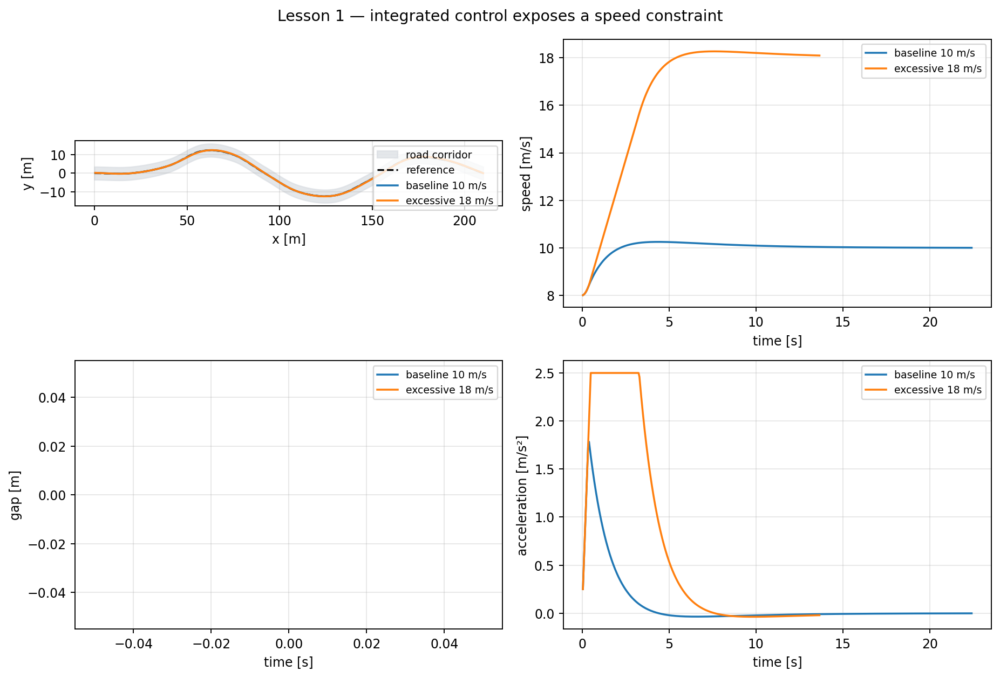

# Lesson 1 — Combining longitudinal and lateral control

## Learning objective

Explain why a steering controller that succeeds at one speed can become
uncomfortable or unrealistic when the longitudinal controller requests a much
higher speed.

## From two controllers to one vehicle

Day 1 produced a target acceleration from speed error. Day 2 produced a target
steering angle from path geometry. In Day 3 both commands act on the same
vehicle:

\[
\begin{aligned}
e_v &= v_{\mathrm{ref}}-v,\\
a_{\mathrm{cmd}} &= K_Pe_v+K_I\int e_v\,dt,\\
\delta_{\mathrm{cmd}} &=
\tan^{-1}\left(\frac{2L\sin\alpha}{L_d}\right).
\end{aligned}
\]

The bicycle model then uses the updated speed:

\[
\dot{x}=v\cos\psi,\qquad
\dot{y}=v\sin\psi,\qquad
\dot{\psi}=\frac{v}{L}\tan\delta.
\]

The equations are coupled through \(v\). The same steering angle produces a
larger yaw rate when speed rises. More importantly, lateral acceleration grows
approximately with speed squared:

\[
a_y=v^2\kappa.
\]

Doubling speed at the same curvature multiplies lateral acceleration by four.

## Controller update order

The prepared simulator uses this order:

1. estimate the vehicle's position along the path;
2. calculate Pure Pursuit steering;
3. obtain a target speed;
4. calculate speed-control acceleration;
5. limit acceleration, braking and jerk;
6. update speed;
7. update position and heading;
8. calculate metrics.

This order is not arbitrary. Steering geometry depends on current pose and
speed, and the pose update must use the acceleration-limited speed.

## Prepared demonstration

Before running, predict which metric changes most when the target rises from
10 to 18 m/s:

- path error;
- peak lateral acceleration;
- speed error;
- completion time.

Run:

```bat
python day_3\demos\lesson1_integrated_control.py
```



Safe teacher edit:

```python
BASELINE_SPEED_MPS = 10.0
EXCESSIVE_SPEED_MPS = 18.0
```

The kinematic controller may still keep the vehicle inside the road at 18
m/s. That does **not** prove the motion is feasible. Inspect lateral
acceleration: the model can describe a trajectory without modelling tire-force
saturation or loss of grip.

## PyQt activity

1. Select **Lesson 1 — integrated baseline**.
2. Pause and note the road shape and target speed.
3. Run until the first major curve.
4. Record peak lateral acceleration.
5. Select **Lesson 1 — excessive speed**.
6. Predict the change before running.
7. Compare the metric cards and live plots.

Use **Single step** to show that steering and speed are recalculated once per
control interval.

## Discussion

Answer:

1. Why can path error remain small even when a command is physically poor?
2. Which omitted effects could make the real car leave the road?
3. Should the steering controller reduce speed, or should another layer create
   a suitable speed target?

The course uses a separate road-speed planning layer. This keeps Pure Pursuit
responsible for geometry and makes the reason for slowing down explicit.

## Summary

- Longitudinal and lateral control act on one coupled system.
- High speed increases yaw rate and lateral demand.
- Kinematic path completion is not evidence of dynamic feasibility.
- The integrated controller therefore needs a curve-aware speed target.
