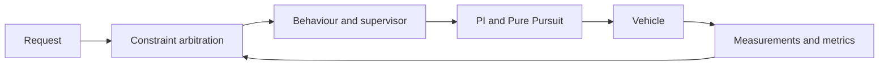

# Lesson 1 — Theory: integrated ADAS, testing and robustness

- **Format:** Short theory sections, team design review and whiteboard work
- **Main outcome:** Turn a vague instruction such as “drive safely and
  comfortably” into a testable controller architecture and acceptance criteria

## The integration problem

The controllers from Days 1 and 2 can each succeed in isolation and still fail
as a vehicle system.

Consider an ego vehicle approaching both a sharp bend and a slower lead car:

- cruise request: $18\ \mathrm{m/s}$;
- curvature-safe target: $10\ \mathrm{m/s}$;
- ACC target: $12\ \mathrm{m/s}$.

The PI controller must not receive three unrelated references. A target
selection layer first chooses:

$$
v_{\mathrm{selected}}=\min(18,10,12)=10\ \mathrm{m/s}.
$$

This resolves the nominal conflict but not the complete problem. The system
must also decide what to do if the range sensor fails, the brake produces only
60% of its nominal force or the vehicle is displaced laterally.

### Opening question

Write one sentence explaining why “all individual controllers passed their
own test” does not imply “the integrated vehicle is safe.”

## Five layers with different responsibilities

| Layer | Question | Example output |
|---|---|---|
| Mission/request | What does the user want? | $v_{\mathrm{cruise}}=15\ \mathrm{m/s}$ |
| Planning/constraints | What is currently allowed? | curve and traffic targets |
| Behaviour | Which operating state applies? | `CRUISE`, `FOLLOW`, `BRAKE` |
| Feedback control | What commands reduce the errors? | throttle, brake, steering |
| Supervision | Can normal control still be trusted? | `SAFE_STOP` override |

The evaluator sits outside these layers. It does not command the vehicle; it
calculates evidence from the resulting trajectory.

### Architecture trace

For each item below, name the layer that should own it:

1. calculate a desired following gap;
2. limit steering to $28^\circ$;
3. decide that radar information is stale;
4. compute RMS jerk after a run;
5. choose the lowest of road and traffic speed;
6. convert a selected speed into throttle or brake.

??? success "Architecture trace — check"
    1. Planning/ACC policy.
    2. Feedback control or actuator interface.
    3. Supervision.
    4. Evaluation.
    5. Constraint arbitration.
    6. Longitudinal feedback control.

## The nominal policy is already a coupled system

The traffic policy starts from a speed-dependent desired gap:

$$
d_{\mathrm{des}}=d_0+T_hv.
$$

When the ego vehicle is closing on a valid lead vehicle, a simplified ACC
target is

$$
v_{\mathrm{ACC}}=\operatorname{clip}\left(
v_L+K_d(d-d_{\mathrm{des}})
-K_{\Delta v}\max(v-v_L,0),0,v_{\mathrm{cruise}}
\right).
$$

The road provides another constraint:

$$
v_{\mathrm{curve}}=
\sqrt{\frac{a_{y,\max}}{\max(|\kappa|,\varepsilon)}}.
$$

The lowest valid constraint becomes the PI speed reference, while Pure Pursuit
calculates steering. This creates cross-effects: speed changes the look-ahead
distance and lateral demand, curvature changes the speed target, and limited
braking changes the following margin.

For the opening values, identify which signal would change first if the lead
vehicle disappeared, the curve became sharper, or brake authority decreased.
Only the first two are nominal planning changes; reduced brake authority is a
fault that must influence supervision and testing.

## Define the operating domain before judging the controller

An experiment is meaningful only when its test domain is explicit. For this
course, define at least:

| Dimension | Example domain statement |
|---|---|
| Speed | $0$ to $18\ \mathrm{m/s}$ |
| Road | Supplied closed tracks, bounded curvature and 5° grades |
| Traffic | One same-lane lead vehicle with supplied schedules |
| Sensing | Pose, speed and range signals described by the simulator |
| Disturbances | Seeded noise, finite delay, one lateral displacement |
| Actuation | Bounded steering, acceleration, braking and jerk |
| Weather/friction | Not modelled |

### Team task: ODD boundary

Mark each claim **inside**, **outside** or **ambiguous** for the simulator:

1. The vehicle follows one supplied lane at 14 m/s.
2. The vehicle avoids a pedestrian entering from the side.
3. The controller tolerates the documented 150 ms sensor delay.
4. The controller is safe on ice.
5. The vehicle preserves a 3 m minimum true gap in all five named scenarios.
6. The controller is safe for every possible random seed.

For every ambiguous claim, rewrite it so it becomes testable.

## Requirements must contain a signal, limit and scope

Weak requirement:

> The vehicle should follow the lane well.

Testable requirement:

> In every published Day 3 scenario, the maximum absolute cross-track error
> shall not exceed 1.60 m and the road-departure percentage shall equal 0%.

A useful requirement states:

1. the measured signal;
2. its aggregation rule;
3. a numerical threshold;
4. the scenarios or operating domain;
5. whether the condition is a safety gate or a performance objective.

### Requirement workshop

Rewrite these four statements:

- Keep a safe distance.
- Do not steer too harshly.
- Recover from radar failure.
- Finish the route quickly.

Use these available metrics:

- collision samples;
- minimum true gap;
- maximum cross-track error;
- road-departure percentage;
- RMS jerk;
- peak steering rate;
- completion percentage or completion time;
- number of `SAFE_STOP` samples.

## Safety gates before weighted performance

The course evaluator uses a hierarchy:

| Priority | Example decision |
|---:|---|
| 1 | Reject any run with collision or road departure |
| 2 | Reject violations of the minimum gap or maximum path error |
| 3 | Check robustness pass rate over the suite |
| 4 | Compare progress, tracking and comfort among passing candidates |

This prevents a dangerous compensation such as using excellent comfort to
offset one collision.

### Counterexample

Candidate A is fast and smooth but collides in one of six cases. Candidate B
is 8% slower and passes all six cases. A simple weighted average may rank A
higher. A gated evaluation must select B.

Explain why this is a design-policy choice, not a mathematical fact.

## Hazard-to-test traceability

Complete at least four rows:

| Hazard | Observable cause | Supervisor/controller response | Test case | Pass evidence |
|---|---|---|---|---|
| Collision with unseen lead | Radar unhealthy or stale | Controlled safe stop | Radar dropout | zero collision, `SAFE_STOP` observed |
| Lane departure after displacement | Large lateral error | Pure Pursuit recovery | Lateral push | 0% outside road |
| Insufficient braking | Reduced brake authority | Larger predictive margin | Brake fade | minimum gap $>3$ m |
| Oscillatory commands | Aggressive gains/rate changes | Limit jerk and retune | Nominal + faults | RMS jerk and peak command rate |
| False fallback on empty road | Confuse “no target” with sensor failure | Use health flag, not detection flag | Nominal | zero false `SAFE_STOP` samples |

## Design review checkpoint

Each team gives a 60-second review containing:

1. one safety gate;
2. one performance objective;
3. one fault and its expected response;
4. one claim the simulator cannot support.

Submit `requirements_and_hazards.md` containing the ODD boundary, four
requirements and the hazard-to-test table.

## Fast-team investigation

Find two requirements that can conflict, for example minimum progress and a
conservative safe stop. Propose an explicit priority rule and one experiment
that reveals the trade-off. Do not change a parameter until you have predicted
which metrics should move and in which direction.
