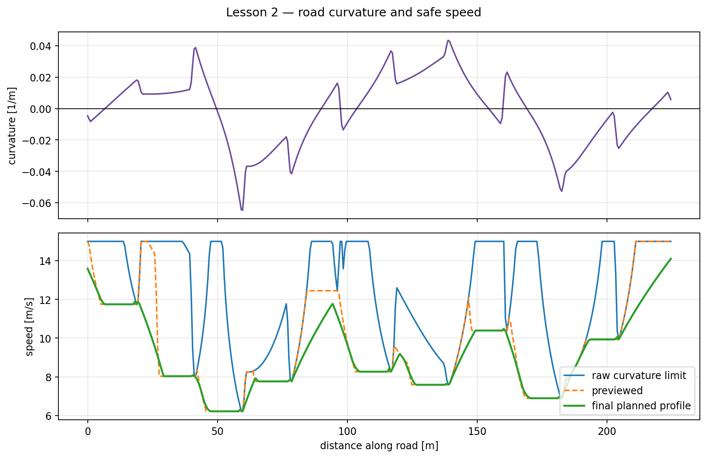

# Lesson 2 — Curvature and safe cornering speed

## Learning objective

Interpret road curvature, calculate lateral acceleration and convert a
cornering limit into a local speed limit.

## Curvature

Curvature describes how quickly path heading changes with travelled distance:

\[
\kappa=\frac{d\psi_{\mathrm{path}}}{ds}.
\]

For a circle:

\[
|\kappa|=\frac{1}{R}.
\]

Therefore:

- \(\kappa=0\): straight road and infinite radius;
- small \(|\kappa|\): gentle curve and large radius;
- large \(|\kappa|\): sharp curve and small radius;
- the sign distinguishes left and right, while safe-speed calculation uses
  the magnitude.

## Lateral acceleration

For motion along a curve:

\[
a_y=\frac{v^2}{R}=v^2|\kappa|.
\]

If a design limit \(a_{y,\max}\) is selected:

\[
v_{\mathrm{safe}}=
\sqrt{\frac{a_{y,\max}}{|\kappa|}}.
\]

The global speed limit must still apply:

\[
v_{\mathrm{road}}=
\min\left(
v_{\max},
\sqrt{\frac{a_{y,\max}}{\max(|\kappa|,\varepsilon)}}
\right).
\]

The small \(\varepsilon\) prevents division by zero on straight sections. It
does not impose a meaningful curve limit there; the global limit dominates.

## Manual examples

With \(a_{y,\max}=2.5\ \mathrm{m/s^2}\):

| Curvature [1/m] | Radius [m] | Calculated speed [m/s] |
|---:|---:|---:|
| 0.01 | 100 | 15.81 |
| 0.04 | 25 | 7.91 |
| 0.10 | 10 | 5.00 |

If the global limit is 15 m/s, the first result is clipped to 15 m/s.

## Prepared demonstration

Run:

```bat
python day_3\demos\lesson2_curvature_safe_speed.py
```



Edit only:

```python
MAX_LATERAL_ACCELERATION_MPS2 = 2.5
GLOBAL_SPEED_LIMIT_MPS = 15.0
EXAMPLE_CURVATURES_PER_M = (0.01, 0.04, 0.10)
```

The upper plot is spatial curvature, not a time history. The lower plot
assigns a speed to positions along the road.

## Predict before changing

Predict:

1. What happens if \(a_{y,\max}\) changes from 2.5 to 1.5 m/s²?
2. Does the change affect straight-road speed?
3. What happens if the sign of curvature changes?
4. Why is a local speed value exactly at the curve entrance insufficient?

The fourth question leads to preview. A vehicle needs distance and time to
brake before reaching the curve.

## PyQt activity

Select **Lesson 2 — curvature map**. The centre-line overlay uses:

- green: near the global limit;
- amber: moderate curve-speed reduction;
- red: sharp curve or low planned speed.

Pause on a coloured section and compare:

- current ego speed;
- selected target;
- peak lateral acceleration.

The road colour is a teaching overlay, not a camera-based perception output.
It comes from the prepared reference path.

## Model limitation

Choosing \(a_{y,\max}\) does not explicitly model:

- tire-road friction;
- bank angle;
- combined braking and cornering;
- load transfer;
- wet, icy or loose surfaces;
- actuator delay.

It is a transparent planning rule, not a guarantee of real-vehicle stability.

## Summary

- Curvature is heading change per travelled distance.
- Lateral acceleration scales with \(v^2|\kappa|\).
- The square-root relationship turns a lateral-acceleration limit into speed.
- A usable profile must anticipate future curvature.
