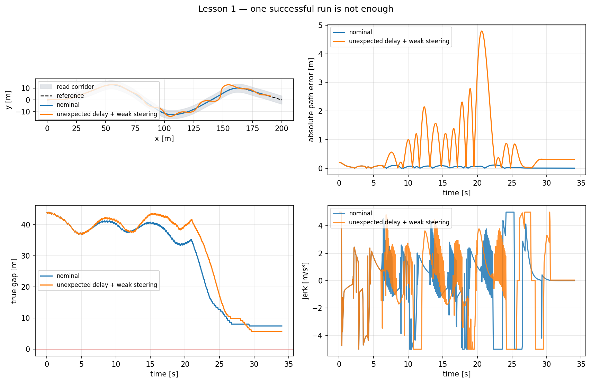
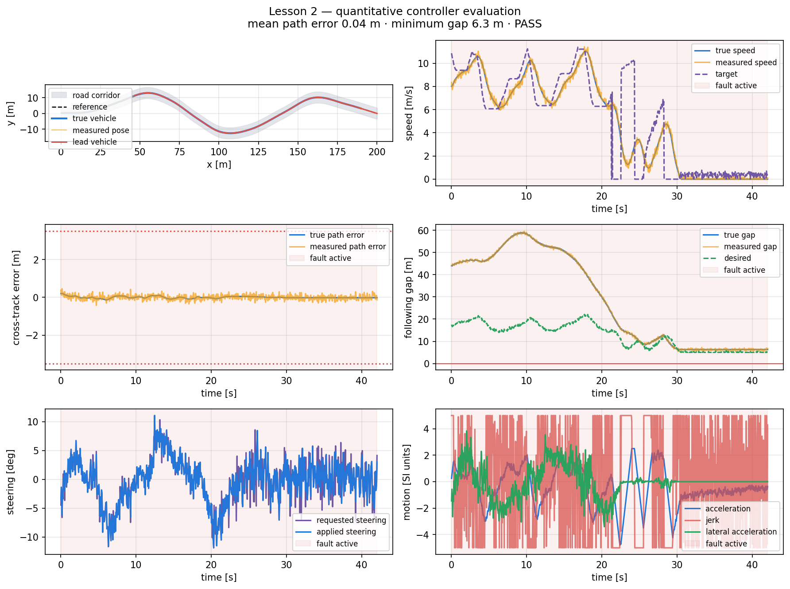

# Lesson 2 — Practical Python demonstrations: integration and robustness

- **Format:** Prepared simulations, controlled experiments and team design task
- **Main outcome:** Tune a coupled ADAS stack using predictions and evidence,
  rather than optimizing one loop in isolation

## Prepare one evidence table

Use one worksheet for all demonstrations. Before each run, write a prediction;
after the run, record evidence rather than only saying that the plot “looks
better.”

| Demonstration | Predicted active constraint/failure | Metric expected to change | Observation | Engineering conclusion |
|---|---|---|---|---|
| Integrated nominal control | | | | |
| Nominal versus disturbance | | | | |
| Quantitative scorecard | | | | |
| Complete-design comparison | | | | |

## Demonstrate the coupled nominal controller

Run from the repository root:

```bat
python courses\day_3\demos\lesson1_integrated_control.py --no-show
```

The plot exposes cruise, curve and traffic limits in one run. Identify every
change of active speed constraint and explain why the PI controller must not
select among these targets itself.

## Show why a nominal success is insufficient

Run the same controller under a defined disturbance:

```bat
python courses\day_3\demos\lesson1_nominal_is_not_enough.py --no-show
```



Find a metric that remains acceptable on average while a short event becomes
unacceptable. This is the practical reason to keep maximum error, minimum gap
and safety gates alongside mean or RMS metrics.

## Read a quantitative scorecard

```bat
python courses\day_3\demos\lesson2_quantitative_evaluation.py --no-show
```



For each metric, state whether lower, higher or zero is preferred, and whether
it is a hard gate or a performance objective. Reject unsafe candidates before
combining performance values into a score.

## Compare complete designs

Run the prepared design comparison:

```bat
python courses\day_3\demos\lesson2_design_tradeoff.py --no-show
```


The comparison uses one unchanged configuration over a suite containing:

- nominal traffic;
- a lateral displacement;
- pose and range noise;
- sensor delay;
- steering bias and reduced authority;
- reduced braking.

Before reading the table, predict which of these changes should mainly affect:

1. minimum gap;
2. maximum path error;
3. RMS jerk;
4. completion time.

## Explain the interacting parameters

| Parameter | Primary effect | Important secondary effect |
|---|---|---|
| `global_speed_limit` | progress and speed | stopping distance, curve demand |
| `maximum_lateral_acceleration` | curve-speed target | comfort and path error |
| `curve_preview_distance` | when curve braking begins | progress, speed RMSE |
| `base_lookahead` | low-speed path response | disturbance recovery |
| `speed_lookahead_gain` | high-speed steering smoothness | corner cutting |
| `time_headway` | desired traffic gap | progress and braking frequency |
| `standstill_gap` | low-speed spacing | stop-and-go availability |
| `emergency_ttc` | emergency-state entry | harsh braking and false triggers |
| PI gains | speed response | overshoot, jerk and saturation |
| `maximum_jerk` | command smoothness | stopping margin and tracking lag |

Changing several values at once may improve the final score but destroys the
causal evidence. Use one-factor experiments first, then test interactions.

## Change one complete candidate

Open:

```text
courses\day_3\student\integrated_design_study.py
```

The script defines four candidates:

- balanced reference;
- high-speed/short-headway candidate;
- conservative candidate;
- a team candidate.

Run:

```bat
python courses\day_3\student\integrated_design_study.py --no-show
```

Record the suite-level result:

| Candidate | Passes | Worst case | Worst min gap | Mean path error | Decision |
|---|---:|---|---:|---:|---|
| Balanced | | | | | |
| Aggressive | | | | | |
| Conservative | | | | | |
| Team | | | | | |

The decision column must be **reject**, **retain for investigation** or
**preferred**, with one metric-based reason.

## One-factor study and one interaction

Choose exactly one parameter family:

=== "Traffic margin"

    Hold everything else fixed and compare:

    ```python
    time_headway = 1.0, 1.5, 2.0
    ```

    Predict the effect on minimum gap, braking activity and progress.

=== "Lateral preview"

    Hold everything else fixed and compare:

    ```python
    base_lookahead = 2.0, 3.0, 5.0
    ```

    Predict the effect on mean path error, maximum path error and steering
    activity after the lateral push.

=== "Curve planning"

    Hold everything else fixed and compare:

    ```python
    maximum_lateral_acceleration = 1.8, 2.5, 3.5
    ```

    Predict the effect on actual peak lateral acceleration, path error and
    completion time.

For each run, write the prediction before running the script:

| Change | Predicted metric direction | Measured change | Explanation |
|---|---|---|---|
| | | | |

### Test an interaction, not another isolated parameter

Select one pair:

1. speed limit × time headway;
2. speed limit × look-ahead gain;
3. maximum lateral acceleration × curve preview;
4. PI gain × jerk limit.

Run a $2\times2$ experiment. If the effect of parameter A changes when
parameter B changes, the parameters interact.

Example layout:

| | Low B | High B |
|---|---:|---:|
| Low A | metric | metric |
| High A | metric | metric |

Calculate the effect of A in each row. Equal effects suggest weak interaction;
very different effects show that tuning the two loops independently is unsafe.

## Safety gate and Pareto decision

After rejecting unsafe candidates, compare the survivors in two objectives:

- efficiency: completion time or progress;
- quality: path error, gap margin or RMS jerk.

A candidate is **dominated** if another candidate is no worse in every chosen
objective and strictly better in at least one. Do not collapse the objectives
into a weighted score until you have inspected the non-dominated set.

### Team decision

Select one configuration for the next block and state:

```text
Configuration selected:
Safety gates passed:
Metric deliberately improved:
Metric deliberately sacrificed:
Evidence that the trade-off is acceptable:
```

## Continue if time remains — Perturb the selected design

Without retuning, test the chosen configuration against one new condition:

- increase sensor delay by 50 ms;
- reduce braking efficiency by a further 10 percentage points;
- change the random seed;
- increase initial lateral offset by 0.3 m.

This is a sensitivity check, not a second tuning set. Report whether the
selection is robust, fragile or inconclusive.

## Fast-team investigation

Extend the candidate table to at least 12 configurations. Filter by safety,
construct a two-objective Pareto front and explain why the “best” point changes
when the chosen objectives change. Keep the practice suite fixed throughout;
do not tune on the evaluation suite.
