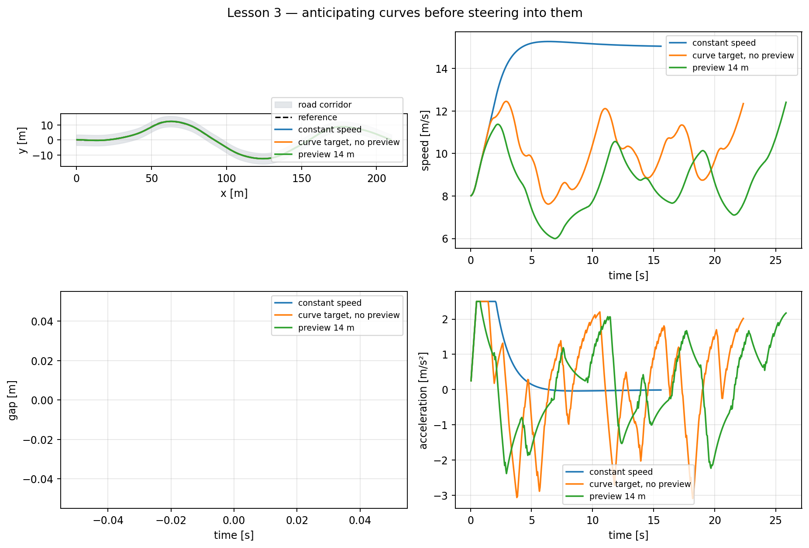

# Lesson 3 — Guided exercise: curve-aware speed control

## Learning objective

Tune global speed, maximum lateral acceleration, preview distance and smoothing
while comparing safety, comfort and completion time.

## From local limit to driveable profile

The raw curve-speed formula gives one value at each path sample. The package
then applies four steps:

1. calculate raw curvature speed;
2. move future low-speed requirements earlier using spatial preview;
3. smooth abrupt sample-to-sample changes;
4. enforce longitudinal acceleration and braking feasibility.

The backward braking pass uses:

\[
v_i^2\leq v_{i+1}^2+2a_{\mathrm{brake}}\Delta s.
\]

The forward acceleration pass uses:

\[
v_{i+1}^2\leq v_i^2+2a_{\mathrm{accel}}\Delta s.
\]

These are spatial forms of constant-acceleration kinematics. They prevent the
profile from requesting an instantaneous speed change.

## Why preview is spatial

A road profile is naturally indexed by distance \(s\), while the vehicle
controller runs in time. Spatial preview means:

> inspect curvature over the next \(D_p\) metres and begin responding to the
> most restrictive upcoming value.

At higher speed the same preview distance provides less preview time. This is
one reason a production planner would use richer prediction.

## Prepared demonstration

Run:

```bat
python day_3\demos\lesson3_curve_aware_control.py
```



The comparison contains:

- constant global speed;
- curve speed with no preview;
- curve speed with 14 m preview.

Inspect peak lateral acceleration and the point at which braking begins.

## Student exercise

Run:

```bat
python day_3\student\exercise_curve_speed_profile.py
```

Edit only:

```python
MAX_LATERAL_ACCELERATION_CANDIDATES = (1.5, 2.5, 4.5)
GLOBAL_SPEED_LIMIT_MPS = 15.0
PREVIEW_DISTANCE_M = 14.0
```

### Core task

1. Predict which candidate completes fastest.
2. Predict which has the lowest peak actual lateral acceleration.
3. Run the baseline and record metrics.
4. Reject configurations that violate your stated lateral objective.
5. Replace one candidate to narrow the useful range.
6. justify one balanced choice using two metrics.

### Engineering task

Keep \(a_{y,\max}=2.5\ \mathrm{m/s^2}\) and compare preview distances:

\[
D_p\in\{0,\ 8,\ 14,\ 24\}\ \mathrm{m}.
\]

Too little preview produces late braking. Too much preview can reduce speed
well before the curve and increase travel time.

### Smoothing task

In the GUI, compare smoothing windows 1, 7 and 21. A larger window may create
a visually smoother target, but smoothing must not raise the command above the
raw safety envelope.

## PyQt activity

1. Select **Lesson 3 — curve-aware speed**.
2. Enable the coloured road and controller geometry.
3. Pause just before an amber/red section.
4. Observe curve target, ego speed and longitudinal acceleration.
5. Reduce preview to zero.
6. rerun and compare the braking location.

## Metrics

The exercise reports:

- path accuracy;
- speed RMSE relative to the changing target;
- peak actual lateral acceleration;
- completion percentage and time;
- jerk.

Speed RMSE can increase when a target changes rapidly, even if the vehicle is
behaving safely. Interpret it together with actuator limits and preview.

## Summary

- Raw curve speed is not yet a driveable reference.
- Preview begins braking before the curve.
- Forward/backward passes enforce simple actuator feasibility.
- Profile tuning is a safety–comfort–time tradeoff.
