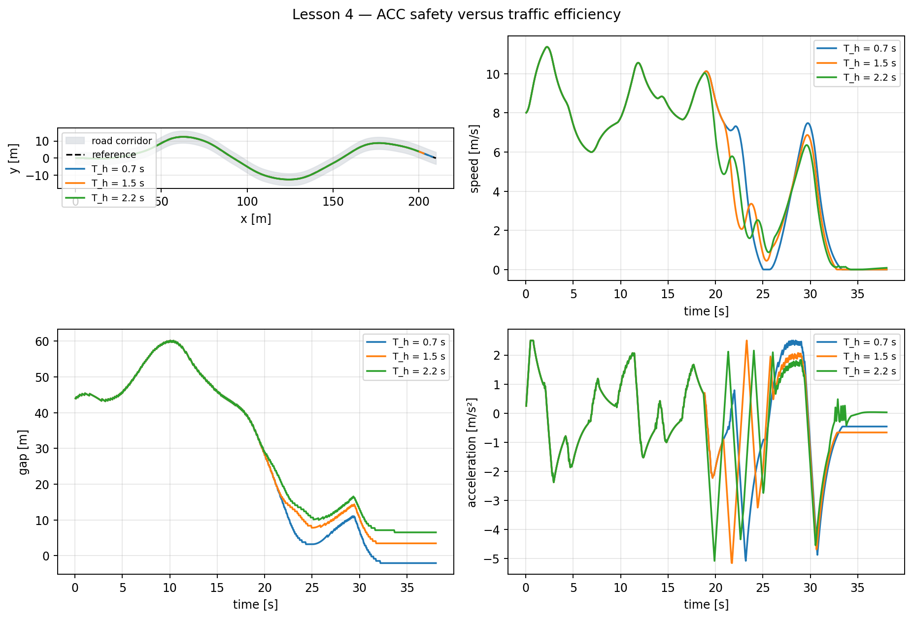

# Lesson 4 — Adaptive Cruise Control

## Learning objective

Calculate a speed-dependent desired following distance and explain the
safety–efficiency effect of time headway.

## Cruise control versus ACC

Ordinary cruise control attempts to maintain a driver-selected speed. Adaptive
Cruise Control also considers a lead vehicle.

Define:

- \(d\): bumper-to-bumper gap;
- \(v\): ego speed;
- \(v_L\): lead speed;
- \(\Delta v=v-v_L\): closing speed;
- \(d_0\): standstill gap;
- \(T_h\): time headway.

The desired gap is:

\[
d_{\mathrm{desired}}=d_0+T_hv.
\]

For \(d_0=5\) m and \(T_h=1.5\) s:

| Ego speed [m/s] | Desired gap [m] |
|---:|---:|
| 0 | 5 |
| 5 | 12.5 |
| 10 | 20 |
| 15 | 27.5 |

The gap grows with speed because a fixed distance provides less response time
at high speed.

## Simplified continuous target

The teaching controller forms a traffic speed target from lead speed, gap
error and closing speed:

\[
v_{\mathrm{ACC}}=
\operatorname{clip}\left(
v_L+K_d(d-d_{\mathrm{desired}})
-K_{\Delta v}\max(\Delta v,0),
0,v_{\mathrm{cruise}}
\right).
\]

This is intentionally simpler than production ACC. It lets students see how
distance and relative speed affect the target.

The integrated arbiter selects:

\[
v_{\mathrm{selected}}=
\min(v_{\mathrm{road}},v_{\mathrm{ACC}}).
\]

The lowest active constraint wins: a clear road does not cancel a sharp
curve, and a straight road does not cancel a close lead vehicle.

## Time to collision

When the ego vehicle is closing:

\[
\mathrm{TTC}=\frac{d}{v-v_L}.
\]

If \(v\leq v_L\), TTC is treated as infinite because the gap is not closing.
TTC is useful but insufficient by itself: it can become large at a short,
nearly constant gap.

## Prepared comparison

Run:

```bat
python day_3\demos\lesson4_acc_headway.py
```



The prepared stop-and-go lead vehicle:

1. begins at 10 m/s;
2. slows to 6 m/s;
3. stops;
4. waits;
5. accelerates again.

The 0.7 s setting is deliberately unsafe in this simplified scenario. The 1.5
and 2.2 s settings retain larger gaps but may reduce completion.

## Student exercise

Run:

```bat
python day_3\student\exercise_acc_headway.py
```

Edit:

```python
TIME_HEADWAY_CANDIDATES_S = (0.7, 1.5, 2.2)
STANDSTILL_GAP_M = 5.0
```

Required evidence:

- minimum gap;
- minimum finite TTC;
- collision samples;
- completion percentage;
- speed trace during lead-vehicle braking.

Do not select a headway solely because it follows more closely.

## PyQt activity

Compare presets:

- **Lesson 4 — short-headway ACC**;
- **Lesson 4 — balanced ACC**.

Observe:

- actual and desired gap traces;
- selected target versus ego and lead speed;
- whether the state is Cruise or Follow;
- cumulative minimum gap.

## Limitations

The lead vehicle follows the known reference path, and its schedule is
deterministic. The simulator omits:

- radar noise and target loss;
- cut-in vehicles;
- road grade;
- communication delay;
- driver override;
- friction-dependent braking distance.

These become robustness and testing topics on Day 4.

## Summary

- Desired gap combines standstill distance and time headway.
- Closing speed adds information not contained in distance alone.
- Road and traffic targets are arbitrated by the minimum.
- Short headway improves density but reduces safety margin.
