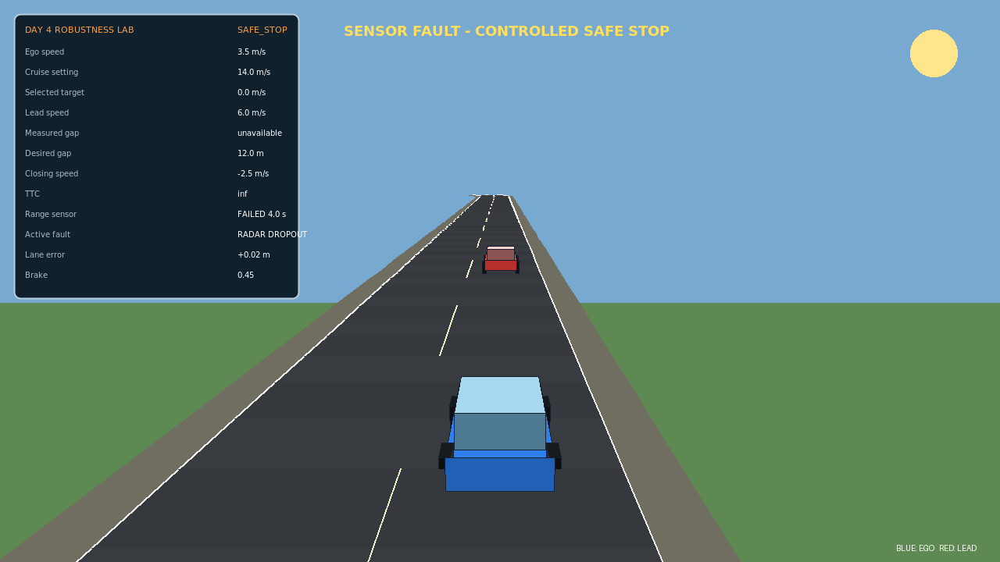
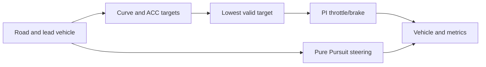

# Lesson 4 — Guided simulator and fault-testing exercises

- **Format:** One PyQt simulator, controlled fault injection and a short batch
  campaign
- **Main outcome:** Diagnose how ACC, curve-speed planning, lateral control and
  faults interact without changing several mechanisms at once

The former Day 3 GUI and Day 4 robustness GUI are combined in this lesson. You
first establish the integrated nominal behaviour, then inject faults in the
same model and finish with a repeatable batch test.



## Start the single guided laboratory

Run from the repository root:

```bat
python courses\day_3\gui\day3_robustness_lab.py
```

The simulator exposes five groups of variables:

| Group | Examples | Main evidence |
|---|---|---|
| Road and planning | path, speed request, curve preview | active speed constraint |
| Lateral control | base look-ahead, speed gain | path error and steering activity |
| ACC | time headway, standstill gap, TTC threshold | true gap and behaviour state |
| Sensing and actuation | noise, delay, steering authority, brake efficiency | measured/true disagreement and margins |
| Evaluation | seed, collision, maximum error, completion | pass/fail decision |

Use **Apply and reset scenario** after every change. Keep a prediction log:

| Run | Changed variable | Prediction | Minimum gap | Maximum path error | Collision/road departure | Conclusion |
|---:|---|---|---:|---:|---|---|
| 0 | none | reference | | | | |
| 1 | | | | | | |
| 2 | | | | | | |
| 3 | | | | | | |
| 4 | | | | | | |

## Establish the integrated nominal reference

Select **Lesson 4 — nominal reference**, apply and run. Trace this causal path:



Pause once while the ego vehicle is curve-limited and once while it is
traffic-limited. At each pause, record:

- cruise, curve and ACC targets;
- selected target and behaviour state;
- actual and desired gap;
- path error;
- throttle, brake and steering commands.

Explain why the selected target can change before either feedback error becomes
large.

## Reproduce the nominal ACC trade-off

Starting from the nominal preset, compare time headways of 0.8 s, 1.5 s and
2.2 s. Keep the path, lead schedule, seed and all other settings unchanged.

Before running, calculate the desired gaps at $v=14\ \mathrm{m/s}$ for
$d_0=5\ \mathrm m$:

$$
d_{\mathrm{des}}=d_0+T_hv.
$$

Do not select the best value from gap alone. Record braking frequency,
completion/progress and whether the controller changes between `FOLLOW`,
`BRAKE` and `EMERGENCY`. State the performance cost that buys the additional
gap margin.

## Inject sensor and actuator delay

Select **Lesson 4 — sensor and actuator delay**. Run it unchanged, then repeat
the nominal preset with the same seed.

Answer from the traces:

1. Which measured signal visibly lags its true value?
2. Does the smallest gap occur before or after the largest closing speed?
3. Which command begins too late?
4. Is the first failed metric longitudinal, lateral or comfort-related?
5. Which one parameter would you test first, and what side effect do you
   predict?

Change only the chosen parameter and rerun both nominal and delay cases.
Reducing the global speed is allowed only if you can explain why a more local
change is insufficient.

## Test reduced braking authority

Select **Lesson 4 — weak braking**. Before pressing Run, estimate whether the
available gap is physically plausible using

$$
d_{\mathrm{req}}
=v\tau+\frac{v^2}{2\eta_Ba_E}
-\frac{v_L^2}{2a_L}+d_0.
$$

The equation is a screening calculation, not a proof. Compare its predicted
trend with the simulator's minimum true gap. Then vary braking efficiency by
one step while holding the random seed and controller fixed.

Record whether the controller:

- detects the danger earlier;
- requests braking earlier;
- merely saturates for longer;
- still violates the minimum-gap gate.

Explain why increasing PI gain cannot restore missing physical brake authority.

## Isolate lateral and combined faults

Run **Lesson 4 — lateral push** and **Lesson 4 — combined disturbance**.

For each run identify the first abnormal signal, the first controller response
and the first metric that approaches a gate. Complete:

| Scenario | First abnormal signal | Controller response | Limiting metric | Likely mechanism |
|---|---|---|---|---|
| Lateral push | | | | |
| Combined | | | | |

The combined run is not diagnosed by naming every injected fault. Identify the
fault that actually determines the pass/fail result and support that claim with
event order or metric evidence.

## Convert the manual experiment into a batch campaign

Close the GUI and run the same controller from fixed initial conditions and
seeds:

```bat
python courses\day_3\student\exercise_batch_testing.py --no-show
python courses\day_3\student\challenge_practice.py --no-show
```

The practice campaign contains nominal, lateral-push, sensor-noise,
sensor-delay, steering-degradation and weak-braking cases. For the worst failed
case, complete this diagnosis before editing anything:

| Evidence | Entry |
|---|---|
| Failed gate | |
| Time/location of worst event | |
| Most likely mechanism | |
| Parameter to change | |
| Predicted benefit | |
| Possible side effect | |
| Other cases that must be rerun | |

Change no more than two related parameters, then rerun all six cases.

## State an evidence-bounded conclusion

Submit the simulator worksheet and the generated practice CSV. Complete:

```text
The nominal controller __________.
The most damaging isolated fault was __________ according to __________.
The combined case failed/passed because __________ occurred before __________.
Changing __________ improved __________ but cost __________.
The unchanged controller passed ___/6 practice cases.
This supports a claim inside __________; it does not establish __________.
```

## Fast-team investigation — find a two-parameter failure boundary

Choose one coupled pair:

- sensor delay × time headway;
- brake efficiency × speed request;
- steering authority × look-ahead gain;
- lateral-push magnitude × speed request.

Evaluate at least a $3\times3$ grid with the controller otherwise frozen. Mark
each cell `PASS`, `FAIL-GAP`, `FAIL-LANE` or `FAIL-PROGRESS`. Select a point
inside a stable passing region rather than the fastest point on the observed
boundary, then test it with one unseen seed without retuning.
