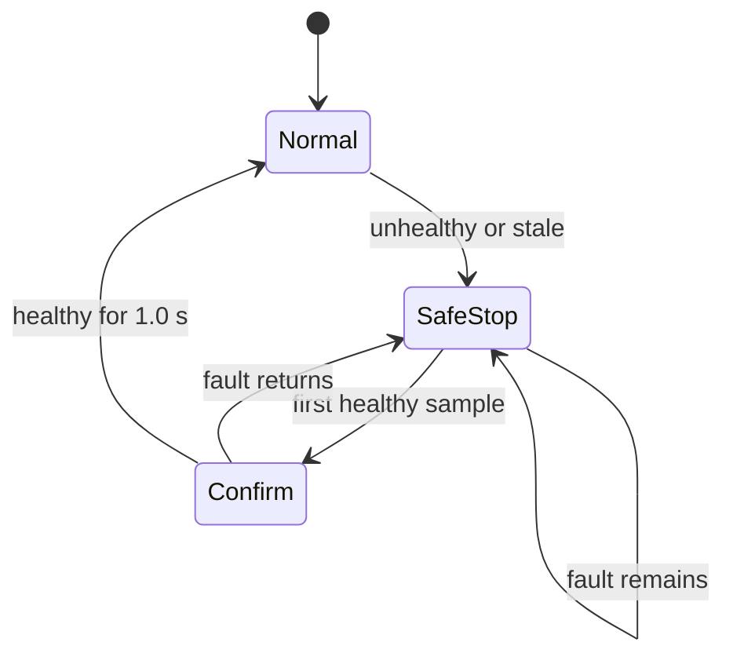

# Lesson 5 — Robust integrated ADAS in the cumulative 3D simulator

- **Format:** Guided implementation and before/after verification
- **Editable file:** `courses\day_3\python_3d_adas_day3\student_controller.py`
- **Main outcome:** Implement a stateful range-sensor fallback without
  disturbing PI speed control or Pure Pursuit steering

## What is already complete

The simulator contains:

- PI throttle/brake control with anti-windup;
- speed-dependent Pure Pursuit steering;
- desired-gap and ACC target calculation;
- `CRUISE`, `FOLLOW`, `BRAKE` and `EMERGENCY` modes;
- a closed road, stop-and-go lead vehicle and 5° grades;
- scenario selection, CSV logging and headless evaluation.

You will add one supervisory function with memory. It must distinguish a valid
empty road from an invalid range sensor, request a safe stop, and avoid
immediately releasing the fallback after a one-sample recovery.

## Use the single scenario menu

Start the simulator:

```bat
cd courses\day_3\python_3d_adas_day3
python run_simulator.py
```

The toolbar contains one scenario menu:

| Scenario | Main injected condition |
|---|---|
| `nominal` | no fault |
| `radar_dropout` | invalid range data from 34 to 43 s |
| `lateral_push` | one 1.35 m lateral displacement |
| `brake_fade` | braking efficiency reduced to 58% |
| `combined` | radar dropout, reduced braking and lateral push |

Select **Reference**, then compare `nominal` and `combined`. Watch speed,
actual/desired gap, mode, radar health and the fault banner.

## Produce the unsafe baseline

The starter controller deliberately contains no range-health supervisor:

```bat
mkdir results
python run_simulator.py --headless --controller student --scenario radar_dropout --duration 50 --target-speed 14 --csv results\radar_dropout_before.csv
```

Record:

| Metric | Baseline |
|---|---:|
| Minimum true gap | |
| Minimum finite TTC | |
| Collision samples | |
| `SAFE_STOP` samples | |
| Maximum lane error | |

Explain the causal chain from sensor dropout to collision. Your answer must
name the signal that changes, the mistaken target selection and the resulting
PI action.

## Define the supervisor as a state machine

The observation provides:

| Field | Meaning |
|---|---|
| `range_sensor_healthy` | diagnostic health status |
| `range_measurement_age` | age of unavailable/stale range information |
| `lead_detected` | valid relevant target is currently available |
| `dt` | controller sample interval |

The controller already contains:

```python
self.MAX_RANGE_AGE_S = 0.25
self.RECOVERY_CONFIRMATION_S = 1.0
self.SAFE_STOP_MIN_BRAKE = 0.45
self.supervisor_latched = False
self.healthy_recovery_time = 0.0
```

Required transitions:



The latch prevents a single healthy sample from immediately restoring cruise.

## Implement the stateful health logic

Find `DAY 3 BLOCK 5 TODO A`. Implement:

```python
sensor_invalid = (
    not observation.range_sensor_healthy
    or observation.range_measurement_age > self.MAX_RANGE_AGE_S
)

if sensor_invalid:
    self.supervisor_latched = True
    self.healthy_recovery_time = 0.0
elif self.supervisor_latched:
    self.healthy_recovery_time += observation.dt
    if self.healthy_recovery_time >= self.RECOVERY_CONFIRMATION_S:
        self.supervisor_latched = False
        self.healthy_recovery_time = 0.0

supervisor_active = self.supervisor_latched
```

Find TODO B and add, before the PI speed error is calculated:

```python
if supervisor_active:
    selected_target = 0.0
    mode = "SAFE_STOP"
```

Why this location matters: changing the target after PI evaluation would only
change the dashboard label; the actuator command would still use the unsafe
normal target for that sample.

## Coordinate fallback braking and integral state

Find TODO C after the `BRAKE` and `EMERGENCY` command overrides. Add:

```python
elif mode == "SAFE_STOP":
    self.integral_error = min(0.0, self.integral_error)
    signed_command = min(
        signed_command,
        -self.SAFE_STOP_MIN_BRAKE,
    )
```

Interpretation:

- the command requests at least 45% normalized braking;
- positive integral memory is removed during the stop;
- negative integral is retained, so the code does not create a positive
  acceleration surge immediately after recovery;
- Pure Pursuit remains active because valid lane/pose information is still
  available in this fault model.

## Verify the same scenario after the change

```bat
python  run_simulator.py --headless --controller student --scenario radar_dropout --duration 50 --target-speed 14 --csv results\radar_dropout_after.csv
```

| Requirement | Before | After | Pass/fail |
|---|---:|---:|---|
| Collision samples $=0$ | | | |
| Minimum true gap $>3$ m | | | |
| `SAFE_STOP` samples $>0$ | | | |
| Road departure $=0\%$ | | | |
| Maximum lane error $<0.75$ m | | | |

Compare the CSV around 33–45 s. Identify:

1. fault entry;
2. first `SAFE_STOP` sample;
3. radar recovery;
4. latch release approximately 1 s later;
5. the first return to normal target selection.

## Run the complete scenario suite

```bat
pyhon evaluate_project.py --controller student --duration 105 --target-speed 14 --csv results\day3_supervisor_suite.csv
```

Expected outcome after a correct implementation:

```text
Suite result: 5/5 scenarios passed
```

If a case fails, diagnose it before retuning:

| Symptom | Likely cause |
|---|---|
| Collision during dropout | override missing, not latched or located after PI |
| Stop on a healthy empty road | used `not lead_detected` as the fault condition |
| No recovery | timer never increments or latch never clears |
| Immediate recovery | confirmation logic bypassed |
| Throttle surge after recovery | integral state not managed |
| Lateral-push failure | unrelated Pure Pursuit code was changed |

## Freeze the implementation

Save:

```bat
copy student_controller.py results\student_controller_block5.py
```

Complete:

```text
Fault-entry condition:
Recovery condition:
Why the supervisor is latched:
Safety benefit:
Progress/comfort cost:
Evidence file:
```

## Fast-team investigations

Choose one; do not silently retune between comparisons.

1. Compare recovery-confirmation times 0, 0.5, 1.0 and 2.0 s. Quantify false
   availability cost using progress and safe-stop duration.
2. Compare minimum fallback brake 0.30, 0.45 and 0.60. Quantify minimum gap,
   peak deceleration and jerk.
3. Create an intermittent dropout by alternating health every 0.2 s in a copy
   of the scenario. Explain how the latch changes the response.
4. Propose a degraded-speed mode instead of a full stop. State the additional
   evidence required before it could be considered safer.
