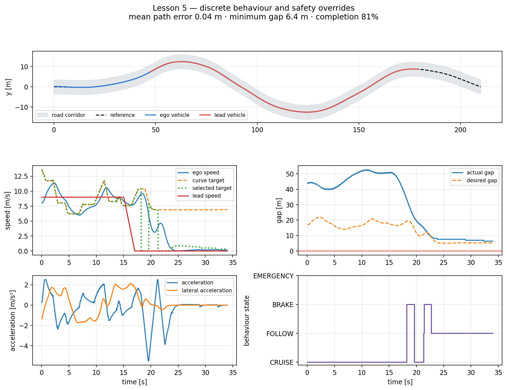

# Lesson 5 — Behaviour states and safety logic

## Learning objective

Trace a Cruise–Follow–Brake–Emergency state machine and explain why thresholds,
overrides and hysteresis are used around continuous controllers.

## Why add discrete behaviour?

A continuous ACC law smoothly changes target speed, but certain situations
require explicit actions:

- no relevant lead vehicle: Cruise;
- lead vehicle within the following region: Follow;
- gap or TTC becoming unsafe: Brake;
- collision imminent: Emergency.

The prepared state machine uses continuous quantities to choose a discrete
state, then supplies the longitudinal controller with a target and, when
needed, a braking override.

## State meanings

| State | Main condition | Target/override |
|---|---|---|
| Cruise | lead vehicle outside following boundary | road/cruise speed |
| Follow | lead vehicle inside following boundary | ACC target |
| Brake | gap too small or TTC low | ACC target plus comfortable-brake cap |
| Emergency | emergency gap or TTC crossed | zero target plus maximum-brake cap |

Emergency logic does not guarantee collision avoidance. It commands the
strongest braking available in this model.

## Simplified transitions

The conditions use:

\[
d_{\mathrm{desired}}=d_0+T_hv
\]

and:

\[
\mathrm{TTC}=\frac{d}{\max(v-v_L,\varepsilon)}.
\]

Important thresholds include:

- follow-entry ratio multiplied by desired gap;
- brake-entry ratio;
- emergency gap;
- emergency TTC.

## Hysteresis

Without hysteresis, measurement variation near a boundary could produce:

\[
\text{Cruise}\leftrightarrow\text{Follow}\leftrightarrow\text{Cruise}
\]

on successive control intervals. The prepared controller uses a slightly
different exit boundary after entering Follow/Brake. This memory reduces
state chatter.

Hysteresis must not delay an emergency transition. Emergency conditions are
checked first.

## Prepared demonstration

Run:

```bat
python day_3\demos\lesson5_behaviour_states.py
```



The terminal prints every state transition with its time. Match those times to
the speed, gap, acceleration and state plots.

Safe edits:

```python
EMERGENCY_TTC_S = 1.25
BRAKE_ENTRY_RATIO = 0.78
```

Predict the consequence of lowering each value before editing.

## Scenario cards

For each case, predict the active state:

1. \(d=60\) m, \(v=10\) m/s, \(v_L=10\) m/s.
2. \(d=19\) m, \(v=10\) m/s, \(v_L=8\) m/s.
3. \(d=10\) m, \(v=12\) m/s, \(v_L=5\) m/s.
4. \(d=2\) m, \(v=8\) m/s, \(v_L=0\) m/s.

The exact answer depends on configured thresholds. Students should calculate
desired gap and TTC, then follow the transition priorities.

## PyQt activity

Select **Lesson 5 — late-braking states**.

1. Run until Brake activates.
2. Pause and record gap, desired gap, ego speed and lead speed.
3. Single-step through several intervals.
4. Reduce emergency TTC.
5. Predict whether Emergency becomes earlier or later.
6. Apply, reset and compare.

The state card changes colour:

- blue: Cruise;
- green: Follow;
- amber: Brake;
- red: Emergency.

## Threshold-design warning

Making thresholds extremely conservative can prevent collision in the
prepared scenario but cause:

- unnecessary braking;
- low traffic throughput;
- poor ride comfort;
- oscillation if thresholds overlap badly;
- inability to complete the route in time.

Making them aggressive can increase efficiency until one disturbance causes a
collision. Threshold tuning must be evaluated on multiple scenarios.

## Summary

- Continuous control and discrete supervision solve different parts.
- State priority makes safety overrides explicit.
- Hysteresis reduces chatter.
- Thresholds trade responsiveness, safety margin and efficiency.
