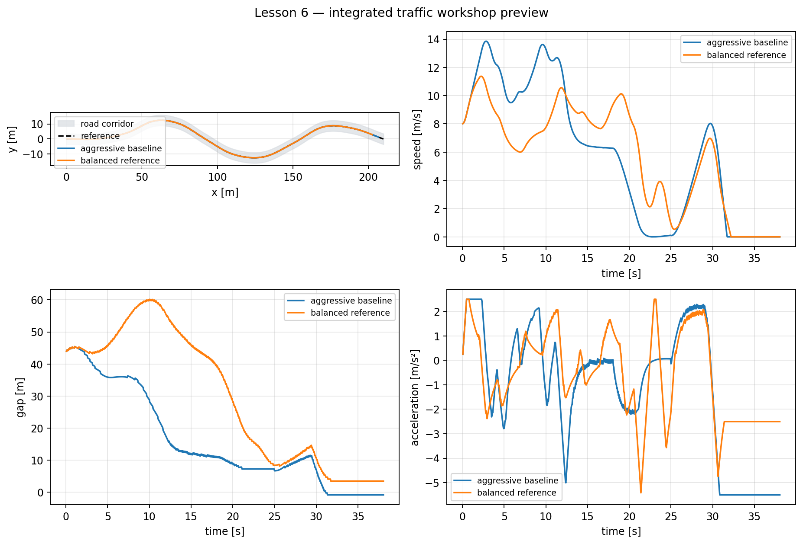

# Lesson 6 — Workshop: integrated traffic scenario

## Learning objective

Tune one configuration that follows the road, respects curve demand, follows
and stops behind a lead vehicle, resumes safely and satisfies quantitative
criteria.

## Scenario

The ego vehicle must:

1. accelerate along the reference road;
2. slow before curved sections;
3. approach a slower lead vehicle;
4. maintain a speed-dependent gap;
5. stop when the lead vehicle stops;
6. resume when it moves;
7. remain within road boundaries throughout.

## Intentionally aggressive starter

Run:

```bat
python day_3\student\workshop_integrated_traffic.py
```

The starter uses:

```python
GLOBAL_SPEED_LIMIT_MPS = 18.0
MAX_LATERAL_ACCELERATION_MPS2 = 4.5
CURVE_PREVIEW_DISTANCE_M = 3.0
TIME_HEADWAY_S = 0.65
EMERGENCY_TTC_S = 0.70
EMERGENCY_GAP_M = 1.2
```

It is expected to fail. The first run is diagnostic evidence, not an answer.

## Mandatory success criteria

| Criterion | Requirement |
|---|---:|
| Collision | none |
| Road departure | 0% |
| Minimum gap | at least 3 m |
| Peak lateral acceleration | at most 3.5 m/s² |
| Route completion | at least 95% |

Safety constraints are checked before the weighted score. An unsafe vehicle is
disqualified even if it finishes quickly.

## Tuning sequence

Use this order:

1. **Remove collision risk.** Increase time headway and restore earlier
   emergency thresholds.
2. **Reduce cornering demand.** Lower maximum lateral acceleration and add
   preview.
3. **Check road tracking.** Keep the Day 2 look-ahead values unless evidence
   shows a lateral failure.
4. **Recover completion.** Raise the global limit only if every safety
   requirement remains satisfied.
5. **Check comfort.** Inspect acceleration and jerk after safety passes.

Changing every parameter simultaneously makes cause and effect impossible to
explain.

## Prepared comparison

```bat
python day_3\demos\lesson6_workshop_preview.py
```



The balanced reference is not a universal optimum. It demonstrates one
configuration that passes on this road and traffic schedule.

## Weighted score

Safe candidates receive a small ranking score based on:

- mean path error;
- speed RMSE;
- peak jerk;
- penalty for low minimum gap;
- incomplete route penalty.

Lower is better. The weights express teaching priorities rather than an
automotive standard.

## PyQt workshop

Use the two presets:

- **Lesson 6 — aggressive workshop**;
- **Lesson 6 — balanced reference**.

Then create your own configuration:

1. pause;
2. change one parameter;
3. state a prediction;
4. select **Apply and reset scenario**;
5. run;
6. inspect all four metric cards and plots;
7. record the result.

## Advanced parameter sweep

Run:

```bat
python day_3\student\advanced_parameter_sweep.py
```

The sweep explores combinations of:

- global speed limit;
- lateral acceleration limit;
- preview distance;
- ACC time headway.

It prints the ten best safe configurations. Explain:

1. Why can two configurations have similar scores for different reasons?
2. Why does ranking on the training scenario risk overfitting?
3. Which unseen scenario should be tested next?

Day 4 answers these questions with disturbances, repeatable tests and an
unseen final challenge.

## Required team conclusion

Report:

- final parameter values;
- minimum gap;
- maximum path error;
- peak lateral acceleration;
- completion percentage;
- one failure observed;
- one proposed real-vehicle improvement.

## Simulation-to-real boundary

The result supports:

- understanding control architecture;
- comparing parameter effects;
- testing logical consistency;
- practising metric-based engineering.

It does not certify:

- tire-force feasibility;
- collision avoidance;
- functional safety;
- perception reliability;
- real-time implementation;
- legal roadworthiness.

## Summary

Day 3 ends with a controller that combines path tracking, road-speed planning,
ACC and behaviour supervision. Day 4 will test whether that success survives
noise, mismatch, braking degradation and unseen scenarios.
