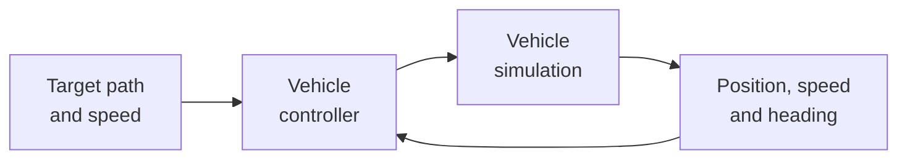

  <h1>Control of Self-Driving Vehicles</h1>
  
From feedback control to an integrated autonomous-driving challenge

  
<strong>Smart Vehicles Summer School 2026</strong>

## What will we build?

During this course, you will progressively develop the controller of a simulated self-driving vehicle. The same lightweight Python project is used throughout the four days, so every new lesson adds a working capability.

By the final lesson, the vehicle will:

- maintain a requested speed;
- follow a curved reference path;
- slow down before sharp curves;
- follow and stop behind another vehicle;
- operate with realistic actuator limits;
- complete an unfamiliar test track under disturbances.

## Four days

-   **Day 1 — Control speed**

    ---

    Build and tune proportional and PI cruise controllers.

    [Start Day 1](day1/index.md)

-   **Day 2 — Control direction**

    ---

    Simulate steering and implement Pure Pursuit path following.

    [Start Day 2](day2/index.md)

-   **Day 3 — Control behaviour**

    ---

    Combine lateral control, curve-aware speed and adaptive cruise control.

    [Start Day 3](day3/index.md)

-   **Day 4 — Test robustness**

    ---

    Measure performance and complete the final autonomous-driving challenge.

    [Start Day 4](day4/index.md)

## How the lessons work

You are not expected to write a complete simulator from scratch. Every exercise follows the same engineering workflow:

1. **Run** a supplied working baseline.
2. **Predict** the effect of a proposed change.
3. **Modify** a small controller function or parameter.
4. **Test** the modified system.
5. **Measure** its performance.
6. **Explain** why the result improved or degraded.

!!! tip "Before the first lesson"
    Complete the [software setup](setup.md) and run the setup check. The course supports both Windows and Ubuntu.

## Learning outcomes

At the end of the course, you will be able to:

- explain the role of control in an autonomous-driving system;
- simulate basic longitudinal and lateral vehicle motion;
- implement and tune feedback speed control;
- implement geometric path following;
- combine speed, steering and behaviour control;
- account for limits, noise, delay and disturbances;
- evaluate a controller with quantitative metrics;
- explain important limitations of simulation.

